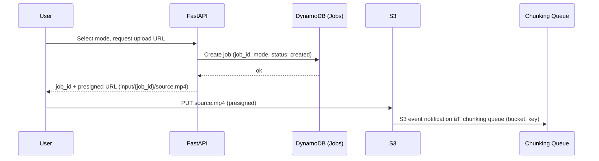

This architecture is designed for

**high-throughput, cost-optimized video processing** using a "Job-Worker" pattern.

**Runbooks:** [docs/RUNBOOKS.md](docs/RUNBOOKS.md) — deploy flow, chunking failure recovery, DLQ handling, and ECS/SQS scaling.

It leverages **ECS (Elastic Container Service)** with **Fargate** for all app workloads (web-ui, media-worker, video-worker) and a **switchable inference backend**: **SageMaker** (default) for GPU inference (**iw3** from [nunif](https://github.com/nagadomi/nunif): 2D→stereo SBS/anaglyph) or **HTTP** (URL you provide, e.g. your own inference server) for dev/testing; **NX** provides shared logic between your UI and Infrastructure-as-Code (IaC).

🏗️ NX Monorepo Structure

Using NX, you unify your frontend, cloud infrastructure, and worker logic. All packages live under **`packages/`** (no `apps/` or `libs/` folders). The **root project** `stereo-spot` provides **`install-deps`**: a single editable install of all Python monorepo packages; test, smoke-test, serve, and gather targets depend on it so one install runs before any dependent target (see [docs/TESTING.md](docs/TESTING.md)).

- `packages/web-ui`: **FastAPI** app (Python) **deployed on ECS Fargate**; **server-rendered UI** (Jinja2 templates). Serves HTML pages for the dashboard, job list, and playback; form POST for job creation (redirect to page with upload URL). Talks to AWS (S3, DynamoDB) via **IAM task role** for presigned URLs, uploads, and listing. See Web UI below.
- `packages/media-worker`: **Single package and Docker image** for all CPU/ffmpeg work: **chunking** (split source with ffmpeg, upload segments to S3) and **reassembly** (ffmpeg concat to produce final 3D file). Consumes both the chunking and reassembly SQS queues in one process (two threads). Runs on **ECS Fargate**; scaled by **Application Auto Scaling** on SQS queue depth (chunking + reassembly). Saves storage (~600MB one image instead of two). See Chunking and Reassembly below.
- `packages/video-worker`: **Thin client / coordinator** (Python container). Code is split into **inference** (video-worker queue, backend-switchable), **segment_output** (segment-output queue), and **reassembly_trigger** (trigger-on-write). Consumes **two SQS queues**: (1) **video-worker queue** — S3 events when segments are uploaded to the input bucket; (2) **segment-output queue** — S3 events when the inference side writes a segment to the output bucket. Invokes inference via a **backend-switchable** path: **stub**, **SageMaker** (async endpoint with S3 URIs), or **HTTP**. For SageMaker, the worker can keep **multiple invocations in flight** (env `INFERENCE_MAX_IN_FLIGHT`), invokes async, and polls for each async response (success/error); **SegmentCompletion is written when the segment-output queue message is processed** (event-driven from output bucket), not by polling for the file. **After each SegmentCompletion put**, the video-worker runs the **reassembly trigger** (trigger-on-write): if the job has `status: chunking_complete` and `count(SegmentCompletions) == total_segments`, it conditionally creates ReassemblyTriggered and sends `job_id` to the reassembly queue. Runs on **ECS Fargate** (no GPU). See The Video Worker below.
- `packages/stereo-inference`: Custom **inference container** (CUDA, **iw3** from [nunif](https://github.com/nagadomi/nunif): 2D video → stereo SBS or anaglyph) used by **SageMaker**. Storage and metrics are adapter-based (`STORAGE_PROVIDER`, `METRICS_PROVIDER`) for AWS/GCP. The handler accepts `input_uri`/`output_uri` or `s3_input_uri`/`s3_output_uri` (s3:// or gs://), runs iw3, and writes the result via the storage adapter. Pre-trained models are **baked into the image** at build time. Optional env **`IW3_LOW_VRAM=1`** reduces VRAM use on smaller GPU instances. **Build** triggers **AWS CodeBuild** (clone repo, build image, push to ECR); **deploy** is **SageMaker** (`sagemaker-deploy`). The package has **test** and **lint** Nx targets (pytest and ruff). When `inference_backend=http`, you run your own inference service and set `inference_http_url`. See [packages/stereo-inference/README.md](packages/stereo-inference/README.md) and [docs/RUNBOOKS.md](docs/RUNBOOKS.md) for optional iw3 tuning (e.g. 60fps, smaller file size, older GPUs).
- `packages/shared-types`: **Python library** (no Docker image). Single source of truth for job, segment, and message shapes used across the pipeline. Defines **Pydantic** models for Jobs, queue payloads, DynamoDB record shapes, and API DTOs. Consumed by `web-ui`, `media-worker`, and `video-worker`. See Shared types and library below.
- `packages/aws-infra-setup`: Terraform backend project that provisions the state file (S3 bucket, DynamoDB for locking). Uses the **nx-terraform** plugin (automatic project discovery and inferred tasks for init, plan, apply, destroy, validate, fmt, output). Linked to `aws-infra`. See [nx-terraform](https://alexpialetski.github.io/nx-terraform/) for documentation.
- `packages/aws-infra`: Terraform project containing the actual AWS infrastructure: S3, SQS, DynamoDB, **ECS cluster**, **ECR**, **CodeBuild** (stereo-inference image build), **task definitions and services** (Fargate for web-ui, media-worker, and video-worker), **inference backend** (default **SageMaker**: model, endpoint config, endpoint for iw3; or **HTTP** using a URL you provide), **ALB**. Uses **nx-terraform** with a backend dependency on `aws-infra-setup`; Nx ensures correct execution order and dependency graph.
- Reassembly trigger logic runs in **video-worker** (trigger-on-write after each SegmentCompletion put). The former `packages/reassembly-trigger` Lambda package has been removed.

To add Google Cloud later, add separate packages: `packages/google-infra-setup` (state) and `packages/google-infra` (GCP resources), following the same nx-terraform pattern.

**Portability and cloud abstractions:** To avoid vendor lock-in and simplify a future GCP (or other cloud) deployment, use **abstractions from the beginning**. Pipeline logic uses **shared-types** and thin interfaces (e.g. in `packages/shared-types`) for: **job store** (get/put/update job), **segment-completion store** (put completion, query by job ordered by segment_index), **queues** (send/receive messages), and **object storage** (presign upload/download, upload/download). **AWS** implementations live in **packages/aws-adapters** (DynamoDB, SQS, S3). **Compute** is cloud-specific: on AWS we use ECS Fargate for all workloads and a **switchable inference backend** (SageMaker or HTTP); on GCP you would use Cloud Run and/or GKE with the same container images, plus a GCP equivalent for the inference endpoint (e.g. Vertex AI), and env-based config. Add **GCP** implementations later (e.g. Firestore, Pub/Sub, GCS) behind the same interfaces. App and workers depend on the abstractions and get the implementation by config (e.g. `STORAGE_ADAPTER=aws`). Terraform remains per-cloud; application and worker code stay the same.

---

📐 Shared types and library (packages/shared-types)

With an all-Python app layer (FastAPI, Python workers), a **single Python package** provides shared domain and message types so every component uses the same shapes and stays in sync. Terraform does not consume these types; it only outputs resource names/ARNs (queue URLs, bucket names, etc.).

**Recommended approach:**

- **Format:** A **Python library** under `packages/shared-types` using **Pydantic** models. No Protobuf or JSON schema is required for the current stack; Pydantic gives validation, serialization, and a single source of truth. If you add non-Python consumers later, you can introduce a schema format (e.g. JSON Schema export from Pydantic) or Protobuf in addition.
- **Segment key convention (single source of truth):** Segment object keys in the input bucket follow **one** format so media-worker and video-worker stay in sync: `segments/{job_id}/{segment_index:05d}_{total_segments:05d}_{mode}.mp4` (zero-padding keeps lexicographic order and avoids ambiguity). The **parser lives only in `shared-types`** (e.g. function or Pydantic validator that takes `bucket + key` and returns the canonical segment payload). Both media-worker (when building keys) and video-worker (when parsing S3 events) use this; no duplicate parsing logic elsewhere.
- **Contents:** The library defines models for:
  - **Job:** `job_id`, `mode` (e.g. literal `anaglyph` | `sbs`), `status` (e.g. `created`, `chunking_complete`, `completed`), optional `created_at`, `total_segments`, `completed_at` — used by web-ui (DynamoDB, API), chunking message, reassembly trigger, and job metadata lookups. "List available movies" queries Jobs with `status = completed`.
  - **Chunking message:** The chunking queue receives the **raw S3 event** (bucket, key). The media-worker parses `job_id` from the key and fetches `mode` from DynamoDB to form the logical payload: `input_s3_uri`, `job_id`, `mode` (consumed by media-worker).
  - **Segment / video-worker message:** `job_id`, `segment_index`, `total_segments`, `segment_s3_uri`, `mode` — payload for the video-worker queue. With **S3→SQS direct**, the queue receives the raw S3 event (bucket, key); the video-worker uses the **segment key parser from `shared-types`** to produce this canonical payload — no Lambda required.
  - **SegmentCompletion:** `job_id`, `segment_index`, `output_s3_uri`, `completed_at`, optional `total_segments` — DynamoDB SegmentCompletions record (written by video-worker; read by media-worker for reassembly; video-worker triggers reassembly when it writes the last completion).
  - **Reassembly message:** `job_id` — payload for the Reassembly SQS queue (sent by video-worker when last segment completes; consumed by media-worker).
  - **API DTOs:** e.g. `CreateJobRequest` (mode), `CreateJobResponse` (job_id, upload_url), `JobListItem`, `PresignedPlaybackResponse` — used by FastAPI for request/response validation and OpenAPI.
- **Consumers:** `web-ui`, `media-worker`, and `video-worker` declare a dependency on `packages/shared-types` in the Nx graph (and in their Python dependency file, e.g. pyproject.toml).
- **Build and versioning:** The shared-types package is a normal Nx project with `test` and `lint` targets. Consumers (workers, web-ui) depend on it via the Nx graph; editable installs are done once by the root target `stereo-spot:install-deps` (test, serve, and gather targets depend on it). There is no Nx build target; to produce a wheel/sdist for publishing, run `python -m build` in the package directory. All apps and workers use the same version from the monorepo; no separate versioning unless you later publish it.

**Summary:** One Python library, Pydantic models, consumed by FastAPI and all Python workers. Keeps job, segment, completion, and API contracts in one place and avoids drift across the pipeline.

---

🖥️ Web UI (packages/web-ui)

**FastAPI** is **deployed on ECS Fargate**. The UI is **server-rendered** (Jinja2): **GET requests for pages return HTML** (dashboard, job list, job detail). Job creation is **form POST** (e.g. select mode, submit) → server creates the job and **redirects** to a page that shows the upload URL and instructions. List of available movies and playback are **HTML pages** (list rendered from DynamoDB; playback can be a link or redirect to the presigned S3 URL). The app talks to **AWS services** (S3, DynamoDB) using **IAM task role**—no long-lived credentials; the browser never sees AWS credentials. Optional: a small **JSON API** under `/api/` (e.g. for future "copy playback link" or automation); for V1, HTML and redirects are sufficient.

- **Job creation and upload:** The user selects **mode** (anaglyph | sbs) in the UI. The FastAPI API **creates a job** (e.g. writes to a DynamoDB Jobs table: `job_id`, `mode`, `status: created`) and returns `job_id` plus a **presigned upload URL** for a deterministic key, e.g. `input/{job_id}/source.mp4`. The browser uploads directly to that URL. When the upload completes, an **S3 event notification** is sent **directly to the chunking SQS queue** (no Lambda). The message payload is the S3 event (bucket, key). The **chunking worker** parses `job_id` from the key (`input/{job_id}/source.mp4`), fetches `mode` from the DynamoDB Jobs table, and proceeds with chunking (see Orchestration).
- **All jobs (unified list):** The UI displays **in-progress** and **completed** jobs. The FastAPI API **queries DynamoDB** using two GSIs: (1) `status-created_at` for in-progress jobs (`status` in created, chunking_in_progress, chunking_complete), descending by `created_at`; (2) `status-completed_at` for completed jobs, descending by `completed_at`, with pagination. Timestamps are formatted client-side in the user's timezone. Do not rely on S3 list for "available" — DynamoDB is authoritative.
- **Video playback:** For completed jobs, the job detail page embeds an **HTML5 video player** (streams from presigned GET URL) plus a separate **Download** button (presigned URL with `ResponseContentDisposition: attachment`). The output S3 bucket has **CORS** configured so the browser can load the video. Live progress (SSE) streams while the job is in progress.

**Pages and routes (server-rendered):** GET `/` → dashboard (HTML); GET `/jobs` → unified list of in-progress and completed jobs (HTML); POST `/jobs` (form: mode) → create job, redirect to job detail; GET `/jobs/{job_id}` → job detail with upload form or video player + download; GET `/jobs/{job_id}/events` → SSE stream for progress; GET `/jobs/{job_id}/play` → redirect to presigned playback URL (legacy); GET `/static/*` → static files (favicon, etc.). OpenAPI/JSON at `/openapi.json` if needed. **ETA:** When `ETA_SECONDS_PER_MB` is set (from infra, e.g. by SageMaker instance type), the job detail page shows an estimated conversion time based on the selected file size (seconds per MB).

**Job creation flow:**

---

☁️ Infrastructure Architecture (AWS Implementation)

**High-level infrastructure:**

**DynamoDB tables and access patterns:**

- **Jobs:** PK `job_id` (String). Attributes: `mode`, `status`, `created_at`, `total_segments`, `completed_at`, etc. **GSI** `status-completed_at`: PK `status`, SK `completed_at` (Number) for list completed jobs. **GSI** `status-created_at`: PK `status`, SK `created_at` (Number) for list in-progress jobs (status in created, chunking_in_progress, chunking_complete).
- **SegmentCompletions:** PK `job_id`, SK `segment_index`. Attributes: `output_s3_uri`, `completed_at`. Query by `job_id` returns segments in order for reassembly.
- **ReassemblyTriggered:** PK `job_id` (String). Attributes: `triggered_at` (Number, Unix timestamp), `ttl` (Number, optional). Used for video-worker trigger idempotency (conditional create when last segment completes) and media-worker lock (conditional write so only one worker runs reassembly per job). Enable **DynamoDB TTL** on `ttl`; set e.g. `ttl = triggered_at + (90 * 86400)` (90 days) so old rows are expired for cost and clarity.

**Access patterns:** (1) List completed jobs: query GSI `status-completed_at` with `status = 'completed'`, `ScanIndexForward = false`, pagination. (2) List in-progress jobs: query GSI `status-created_at` for each of created, chunking_in_progress, chunking_complete, merge and sort by `created_at` desc. (3) Get/update job by `job_id`. (4) Query SegmentCompletions by `job_id`. (5) Conditional write to ReassemblyTriggered by `job_id`.

**Job status lifecycle:** Jobs move through the following statuses. **`created`** — set by web-ui when the job is created (DynamoDB put). **`chunking_in_progress`** — set by the media-worker when it starts processing the chunking message (optional but recommended so the "chunking failure recovery" janitor can find stuck jobs). **`chunking_complete`** — set by the media-worker in a single atomic UpdateItem when chunking finishes (`total_segments` and `status: chunking_complete`). **`completed`** — set by the media-worker (reassembly) after it successfully writes `final.mp4` and updates the Job record. Only DynamoDB is authoritative for status; no separate state store.

**Reassembly state:** The **video-worker** (after each SegmentCompletion put) checks whether the job has `status: chunking_complete` and `count(SegmentCompletions) == total_segments`; when so, it performs a **conditional create** on **ReassemblyTriggered** (item must not exist) and on success sends `job_id` to the Reassembly queue (trigger-on-write; no DynamoDB Stream or Lambda). The **media-worker** (reassembly thread) uses the same table for a per-job lock: before concat it does a **conditional write** (e.g. set `reassembly_started_at` only if the item exists and that field is absent) so only one worker runs reassembly for that job; then it updates the Job to `status: completed`. So: video-worker writes "triggered" (idempotency); media-worker writes "started" and later Job "completed".

1.  **Storage (S3) and key layout:**
    - **Input bucket** (`s3://input-bucket/`): User uploads full MP4 to `input/{job_id}/source.mp4`. **S3 event notifications** are configured for **`s3:ObjectCreated:*`** (e.g. Put, CompleteMultipartUpload). Use **two S3 event notifications** (or prefix/suffix filters) so routing is explicit: (1) **prefix `input/`**, suffix `.mp4` → **chunking SQS queue**; (2) **prefix `segments/`**, suffix `.mp4` → **video-worker SQS queue**. No Lambda. Duplicate S3 events are possible and are handled by idempotent processing (deterministic keys and overwrites). The **media-worker** uploads segment files to the **same bucket** under the **canonical segment key** `segments/{job_id}/{segment_index:05d}_{total_segments:05d}_{mode}.mp4` (e.g. `segments/job-abc/00042_00100_anaglyph.mp4`); those uploads trigger (2) and go to the video-worker queue (see S3 → video-worker path below).
    - **Output bucket** (`s3://output-bucket/`): The **inference** side (SageMaker endpoint or HTTP server) writes segment outputs to `jobs/{job_id}/segments/{segment_index}.mp4` (at the video-worker's request, passing the canonical output URI); the **video-worker** writes only the SegmentCompletion record to DynamoDB. The **media-worker** (reassembly) writes the final file to `jobs/{job_id}/final.mp4`. An **S3 lifecycle rule** on this bucket expires objects under the `jobs/*/segments/` prefix after **1 day**; `jobs/{job_id}/final.mp4` is not affected. **CORS** is configured on the output bucket so the web UI can stream video from presigned URLs in the browser.
    - **Summary:** One input bucket (prefixes `input/`, `segments/`); one output bucket (prefix `jobs/`). All keys are deterministic so idempotency and routing are straightforward.
2.  **Orchestration (SQS + ECS):**
    - **Two S3 event flows (both S3 → SQS direct, no Lambda):** (1) **Full-file upload** → S3 event notification → **chunking queue** → media-worker (parses `job_id` from key and fetches `mode` from DynamoDB). (2) **Segment-file upload** (by media-worker) → S3 event notification → **video-worker queue** (see S3 → video-worker path below).
    - **Application Auto Scaling** scales the **media-worker** ECS service on chunking + reassembly queue depth and the **video-worker** ECS service on the video-worker queue depth. Workers use **SQS long polling** (WaitTimeSeconds, default 20s via optional env `SQS_LONG_POLL_WAIT_SECONDS`) so messages are picked up as soon as they arrive. GPU inference runs on **SageMaker** (default) or on an **HTTP server** (URL you provide); when using SageMaker, use a real-time endpoint (e.g. `ml.g4dn.xlarge`) or Serverless and scale as needed.
    - **Capacity (single region):** **Video-worker SQS visibility timeout** can be lower than full inference time (e.g. 10 minutes) because the worker only invokes async and polls for the small async response; it does not hold the message until the segment file appears. **Multi-region** is not in scope for now (single-user / personal use); add only if needed for availability.
3.  **S3 event → video-worker path (two queues):**
    - **(1) Inference request:** Segment objects uploaded by the media-worker trigger S3 event notifications to the **video-worker SQS queue**; the message is the raw S3 event (bucket, key). The **segment key parser is implemented only in `shared-types`**. The video-worker invokes inference (SageMaker async, HTTP, or stub). For **SageMaker**, it polls only for the async response (success/error); on success it deletes the message and does **not** write SegmentCompletion here (completion is event-driven from the output bucket).
    - **(2) Segment output (completion):** When the inference side writes a segment to the output bucket at `jobs/{job_id}/segments/{segment_index}.mp4`, **S3 sends an event to the segment-output SQS queue**. The video-worker consumes this queue and writes the **SegmentCompletion** record to DynamoDB. Segment completion is thus **event-driven** from the output bucket, not by polling for the file. Keys like `jobs/{job_id}/final.mp4` are ignored by the segment-output handler (parser returns None).
    - **Duplicate S3 events:** Processing is **idempotent**. The inference side writes output to the deterministic path; duplicate events may cause duplicate messages but reprocessing overwrites the same segment output and SegmentCompletion put is idempotent.

4.  **Initial chunking (packages/media-worker — chunking):**
    - **Media-worker** handles chunking in one thread: **chunk** (ffmpeg, keyframe-aligned, e.g. ~50MB / ~5 min) and **upload** segment files to S3. Does **not** publish segment messages to SQS; it only writes segment objects. Segment keys and/or object metadata carry job_id, segment_index, total_segments, mode for the S3 → video-worker path.
    - **Chunking message (input source):** The chunking queue receives the **raw S3 event** (bucket, key). The **media-worker** (chunking thread) extracts the **input S3 URI** from the event, **parses `job_id`** from the key (`input/{job_id}/source.mp4`), **fetches `mode`** from the DynamoDB Jobs table, then **updates the Job to `status: chunking_in_progress`** (so recovery tools can find stuck jobs), downloads the source, runs ffmpeg to split, and uploads segments to S3 using the **canonical segment key** `segments/{job_id}/{segment_index:05d}_{total_segments:05d}_{mode}.mp4`. After chunking completes, the worker performs a **single atomic DynamoDB UpdateItem** that sets **`total_segments`** and **`status: chunking_complete`** (and optionally `chunking_completed_at`) on the Job record in one operation. Use a condition (e.g. `status = chunking_in_progress` or `created`) so the final update only applies when the job is in the expected state.
    - **Failure and retries:** Chunking is **idempotent**: segment keys are deterministic (the canonical format above). On failure, the message returns to the queue after visibility timeout and is retried; the worker may re-upload and overwrite the same segment objects. Downstream (video-worker) handles duplicate segment events via idempotent segment processing. No explicit cleanup of partial segments is required for correctness; optional enhancement is a "chunking started" marker and cleanup on retry.
5.  **The Video Worker (Thin client / coordinator, backend-switchable inference):**
    - The video-worker (Fargate) runs **two loops** (two threads): **(1) Inference** (`inference` module) — pulls from the video-worker queue, parses the segment payload via shared-types, builds the canonical output URI `s3://output-bucket/jobs/{job_id}/segments/{segment_index}.mp4`, and invokes inference. **(2) Segment-output** (`segment_output` module) — pulls from the segment-output queue (S3 events when objects are created in the output bucket under `jobs/`, suffix `.mp4`), parses the key via `parse_output_segment_key` (shared-types), and writes the **SegmentCompletion** record to DynamoDB. Segment completion is **event-driven** (no polling for the file).
    - Inference is **backend-switchable** via `INFERENCE_BACKEND`: **(1) stub** — download, stub, upload, write SegmentCompletion in the inference path. **(2) sagemaker** — **SageMaker InvokeEndpointAsync** with JSON `{"s3_input_uri", "s3_output_uri", "mode"}`; the worker can keep up to **INFERENCE_MAX_IN_FLIGHT** (default 5) invocations in flight, polls for each async response (success/error); on success it deletes the message and does **not** write SegmentCompletion (the segment-output consumer does when the file appears). **(3) http** — POST to `INFERENCE_HTTP_URL/invocations`; then write SegmentCompletion and delete. The inference side (SageMaker or HTTP server) reads the segment from storage (S3 or GCS via adapter), runs **iw3**, and writes the stereo segment to the given output URI. **Sizing:** Segment processing time is dominated by inference; set endpoint/EC2 capacity accordingly (see RUNBOOKS and stereo-inference README).
6.  **Job and segment model:**
    - **Job** = one movie conversion (one input file → one output 3D file). Has `job_id`, `mode` (anaglyph | sbs), etc.
    - **Segment** = one chunk of that movie (e.g. 50MB / ~5 min), produced by the media-worker as a **segment file** in S3. S3 events (or Lambda) produce one message per segment for the video-worker queue; message or object key/metadata carries `job_id`, `segment_index`, `total_segments`, segment S3 URI, `mode`.
    - **Standard SQS** (not FIFO) for higher throughput. Ordering enforced at reassembly by `segment_index`; workers process segments in any order.
7.  **Reassembly (trigger-on-write in video-worker):**
    - The **inference** side (SageMaker or HTTP server) writes segment outputs to `s3://output-bucket/jobs/{job_id}/segments/{segment_index}.mp4`. **S3 notifies the segment-output queue**; the **video-worker** (segment-output consumer) writes a record to the **SegmentCompletions** DynamoDB table (`job_id`, `segment_index`, `output_s3_uri`, `completed_at`). The table uses **`job_id` as partition key** and **`segment_index` as sort key**, so a Query by `job_id` returns segments in order and the media-worker can build the concat list without application-side sorting. **`total_segments`** and **`status: chunking_complete`** for a job are set by the **media-worker** (chunking) when it finishes (written to the Job record in DynamoDB).
    - **Reassembly trigger:** The **video-worker** runs the trigger **after each SegmentCompletion put** (trigger-on-write): it fetches the Job (`total_segments`, `status`), counts SegmentCompletions for that `job_id`, and **only considers triggering when** the Job has `status: chunking_complete` and the count equals `total_segments`. When that condition holds, it performs a **conditional create** on **ReassemblyTriggered** (item must not exist); if the create succeeds, it sends `job_id` to the Reassembly SQS queue. **Idempotency:** The conditional create ensures at most one reassembly message per job even when multiple segment-output messages complete concurrently. No DynamoDB Stream or Lambda is used for this path.
    - **Chunking failure recovery:** If the media-worker crashes after uploading segments but before writing `total_segments` / `chunking_complete`, reassembly would never trigger. **V1 — manual recovery:** Document the procedure: list S3 prefix `segments/{job_id}/`, derive `total_segments` from the max `segment_index` in the key pattern (or key parser in shared-types), then perform a single DynamoDB UpdateItem on the Job to set `total_segments` and `status: chunking_complete` so the video-worker will trigger reassembly when the next SegmentCompletion is written (e.g. if segment-output messages are reprocessed) or a janitor can send to the reassembly queue. **Future enhancement:** A small periodic "janitor" (e.g. Lambda on schedule or in-cluster CronJob) that finds Jobs stuck in `chunking_in_progress` (or similar) older than a threshold, lists `segments/{job_id}/` in S3, infers `total_segments` consistently, and updates the Job as above.
    - The **media-worker** (reassembly thread, same ECS cluster, CPU-only Fargate service scaled by Application Auto Scaling on chunking and reassembly queues) pulls the message, **builds the segment list from DynamoDB**: it queries **SegmentCompletions** by `job_id` ordered by `segment_index`, and uses `output_s3_uri` (or the deterministic path `jobs/{job_id}/segments/{segment_index}.mp4`) to build the ffmpeg concat list. It does **not** discover segments by listing S3 (to avoid races). Optionally it verifies each segment object exists in S3 before concat. Output: `s3://output-bucket/jobs/{job_id}/final.mp4`. After success, the worker **updates the Job record to `status: completed`** (and optionally `final_s3_uri`, `completed_at`) so "list available movies" uses DynamoDB as source of truth. **Segment object retention:** Segment objects in the output bucket (`jobs/{job_id}/segments/`) are retained for **1 day** via an **S3 lifecycle rule** (expire after 1 day); `jobs/{job_id}/final.mp4` is not affected. **Idempotency:** Standard SQS can deliver duplicate or out-of-order messages. The reassembly worker uses the **ReassemblyTriggered** table as a lock: the video-worker has already created the item (conditional create). The worker does a **conditional update** (e.g. set `reassembly_started_at` only if the item exists and that attribute is absent) so only one worker proceeds; if the update fails (another worker started), it skips and deletes the message. On success it builds the concat list, writes `final.mp4`, updates the Job to `status: completed`, then deletes the message. It also checks if `final.mp4` already exists and skips concat if so (updating Job status if needed).

**End-to-end job pipeline (life of a job):**

8.  **Web UI (ECS):** The **FastAPI app** runs as an ECS Fargate service. It serves the dashboard and an API (FastAPI routes) that uses the **AWS SDK** (boto3) with **IAM task role** to list S3/DynamoDB and generate presigned upload and playback URLs. Exposed via an **ALB** in front of the service. **Authentication:** No auth for now (single-user / personal use). No VPN; access is as configured (e.g. ALB). Add auth (e.g. Cognito OIDC) when opening to more users. **Multi-user:** Supporting multiple users would require introducing a **`user_id`** (or similar) in the job and segment data model and in IAM so presigned URLs and API access are scoped per user.

---

📦 Build, Registry, and Deployment

**Stages are split:** Terraform provisions AWS infra (S3, SQS, DynamoDB, ECR, **ECS cluster**, **task definitions**, **services**, **ALB**). Workload updates are deployed by **building and pushing** images to ECR, then **updating ECS services** (e.g. `aws ecs update-service --force-new-deployment` or Terraform with an image tag variable).

**ECS workloads:**

**Build and deploy pipeline:**

1.  **Registry (ECR):** Terraform creates **AWS ECR** repositories (one per image: `web-ui`, `media-worker`, `video-worker`, and the **stereo-inference image** e.g. `stereo-spot-inference`). All images are pushed to ECR so ECS (and SageMaker) in the same account/region can pull them without extra configuration.
2.  **Build and push:** Each package (web-ui, media-worker, video-worker) is packaged into a **Docker image** and pushed to its ECR repo. The **inference container** (iw3/nunif) is built via **AWS CodeBuild**: `nx run stereo-inference:sagemaker-build` triggers CodeBuild to clone the repo, build the image, and push to ECR. **Deploy** (when using SageMaker): `nx run stereo-inference:sagemaker-deploy` updates the endpoint. When `inference_backend=http`, you run and update your own inference service. See [docs/RUNBOOKS.md](docs/RUNBOOKS.md) for order of operations. Builds can run **in parallel**. Use a **single image identifier per release** (e.g. git SHA); when using CI, deploy only after all image build/push jobs succeed.
3.  **Deploy ECS and inference:** Task definitions reference ECR image URIs and a tag. Video-worker env is set by Terraform: when `inference_backend=sagemaker` (default), it gets SageMaker endpoint name and region; when `inference_backend=http`, it gets `INFERENCE_HTTP_URL` (from variable). After building and pushing images, update the **inference** side (SageMaker endpoint or your own server), then run **force new deployment** on ECS services. Full pipeline: **Terraform apply** → **build + push images** → **update SageMaker endpoint** (if that image changed) → **force new deployment** on ECS. See [docs/RUNBOOKS.md](docs/RUNBOOKS.md) for details.

---

🛠️ Handling Spot Terminations & Large Files

To ensure **"Very Good Error Handling"** for large video files:

- **Chunking strategy:** Initial chunking is done by the **media-worker** (see above): ffmpeg splits the source into keyframe-aligned segments (~50MB / ~5 min) and uploads them to S3; S3 events on segment uploads drive video-worker processing. Segment size limits the "blast radius" of a Spot interruption to roughly one segment (e.g. 5 minutes of work).
- **Spot on ECS:** ECS handles Spot interruption: tasks are stopped and messages return to SQS (segment-level retry). The video-worker runs on Fargate (no Spot at the task level). GPU capacity is on **SageMaker**; you can configure the endpoint for Spot or on-demand instances as needed.
- **Atomic Uploads:** Use S3 Multipart Uploads for the final 3D file (media-worker → output bucket) to handle network flakiness during the upload of large assets.
- **Large user uploads:** **V1:** Support only **single presigned PUT** for the source file. **Max file size for V1: ~500 MB** (S3 allows up to 5 GB single PUT, but browser and timeouts suggest this practical limit). **Later enhancement:** For larger files, the API can support **S3 multipart upload** (initiate multipart upload → presigned URLs per part → complete multipart upload); the object key remains `input/{job_id}/source.mp4`, so the same S3 event notification triggers chunking.
- **Checkpointing and resumability (V1 — simple):** **Segment-level retry only.** If a worker is interrupted mid-segment (e.g. Spot reclaim), the message returns to the queue after visibility timeout and is **reprocessed from the start**; no frame-level checkpoint. At ~5 min per segment, losing one segment's work is acceptable and keeps the design simple. Optionally add a **metric** (e.g. segment retry or reprocess count) for visibility. Frame-level resume (checkpoint on SIGTERM, resume from `start_frame`) is **out of scope for V1**; consider as a future enhancement if needed.
- **DynamoDB usage:** Use **separate tables** for distinct concerns: (1) **SegmentCompletions**—segment completion tracking for reassembly (`job_id`, `segment_index`, `output_s3_uri`, `completed_at`); (2) **ReassemblyTriggered**—one row per `job_id` for video-worker trigger idempotency and media-worker lock (see DynamoDB tables below). Do not mix completion state with liveness in one table. **Future:** WorkerHeartbeats (`job_id`, `segment_index`, `worker_id`, `last_heartbeat`) for progress UI and optional frame-level resume; not required for V1.

---

💰 Cost

- **Main levers:** **SageMaker** endpoint instance cost (GPU, e.g. ml.g4dn/ml.g5), S3 storage and egress, DynamoDB read/write, Fargate. Segment sizing (~50MB / ~5 min) keeps cost predictable for batch video work. (Reassembly trigger runs in the video-worker ECS task; no Lambda for this path.)
- **Guardrails:** Set **ECS service max capacity** (e.g. max tasks for video-worker) and **SageMaker** endpoint instance count (or use Serverless) to cap scale. **SQS:** Each main queue (chunking, video-worker, reassembly) has a **Dead-Letter Queue (DLQ)** and a **max receive count** (e.g. 3–5); after that, messages move to the DLQ. Add a **CloudWatch alarm** on "number of messages in each DLQ" (e.g. > 0) so failed messages are visible and do not spin forever. Tag resources (e.g. `project=stereo-spot`) for billing visibility; optionally set **AWS Budgets** alerts.

---

🔒 Security and Operations

- **IAM:** ECS tasks use **task roles** (not IRSA) for S3, SQS, and DynamoDB; no long-lived access keys.
- **Network:** Fargate tasks run in **private subnets**; ALB in **public subnets**. Use an **S3 VPC endpoint** (gateway) to avoid NAT and improve throughput and cost.
- **Secrets:** The current iw3 inference image bakes models into the image and does not require Secrets Manager at startup. Store other API keys or model artifacts in Secrets Manager or S3 with restricted access; mount or pull at runtime as needed.
- **Observability:** Use **CloudWatch** for worker logs and metrics; optional **X-Ray** for tracing.
  - **Custom metric:** The SageMaker inference container emits **SegmentConversionDurationSeconds** and **ConversionSecondsPerMb** to namespace **StereoSpot/Conversion** with dimensions **Cloud** and **SegmentSizeBucket** (e.g. 0-5, 5-20, 20-50, 50+ MB) after each segment conversion; the analytics gather aggregates ConversionSecondsPerMb for ETA and per-bucket breakdown so you can tune segment size and instance type and predict runtimes.
  - **Analytics pipeline:** Run **`nx run aws-infra:gather-analytics`** (or **`nx run analytics:gather --configuration=aws`**) to pull CloudWatch metrics into a file; maintain **packages/analytics/analytics_history.md** (table of cloud, backend, instance type, avg_duration_sec, eta_seconds_per_mb, date); use **packages/analytics/analyze_analytics.md** with an LLM to compare latest analytics with history and suggest infra changes.
  - **V1 observability:** Expose or derive a metric for "segments completed / total_segments" per job (e.g. from SegmentCompletions and Job metadata). Add a **CloudWatch alarm** (or equivalent) when no new segment has completed for a job for a configured threshold (e.g. N minutes) to detect stuck jobs.
  - **Job-level visibility:** SegmentCompletions (and job metadata) are the source of truth for progress.
  - **Reassembly:** Monitor Reassembly SQS queue depth and media-worker error logs; alert on depth above threshold or repeated failures.
  - **Tracing (optional):** Propagate `job_id` and `segment_index` in logs and X-Ray so a single job can be traced from chunking → video-worker → reassembly.

**Risks and follow-ups (to look into later):**

- **Multiple uploads per job_id:** If the user uploads again to the same `input/{job_id}/source.mp4`, S3 overwrites the object and sends a new event to the chunking queue. Chunking is **idempotent** (deterministic segment keys), so the job is re-chunked and video-worker/reassembly behaviour are unchanged. For V1 we do not prevent or deduplicate this. Optional later: enforce a single upload per job (e.g. conditional write on a `source_uploaded_at` attribute) or document that re-upload means re-processing the job.
- **Segment key format and parsing drift:** The segment key format and **parser are implemented only in `shared-types`**; media-worker and video-worker both use that library—no duplicate parsing logic. Add integration tests that round-trip key generation and parsing so both sides stay in sync.

---

🔄 Migration Path to Google Cloud (GCP) 

The pipeline uses **shared-types** and **cloud abstractions** (JobStore, QueueSender/Receiver, ObjectStorage); application and worker code stay the same. Moving to GCP is feasible with new Terraform and adapters:

- **ECS → Cloud Run and/or GKE:** Same container images; GCP Terraform (e.g. `packages/google-infra`) would provision **Cloud Run** services or **GKE** with similar env vars. **SageMaker → Vertex AI** (or similar) for the iw3 inference endpoint; video-worker would call the GCP endpoint instead of InvokeEndpoint. No change to app logic beyond config.
- **SQS → Pub/Sub:** Queue semantics and IAM differ; implement a GCP adapter behind the same queue interface; reassembly trigger would use Pub/Sub or equivalent.
- **S3 → GCS:** Implement GCP object-storage adapter; both use similar SDK patterns.
- **DynamoDB → Firestore:** Implement GCP job and segment-completion stores behind existing interfaces.
- **Terraform:** Keep `packages/aws-infra-setup` and `packages/aws-infra` for AWS. Add `packages/google-infra-setup` and `packages/google-infra` using the Google provider and the same nx-terraform pattern when migrating.
