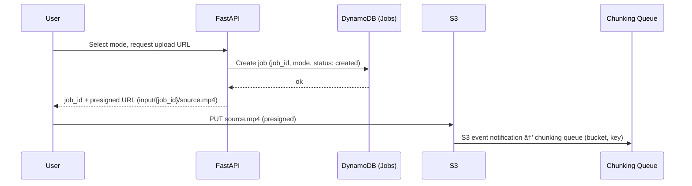

This architecture is designed for

**high-throughput, cost-optimized video processing** using a "Job-Worker" pattern. It leverages **EKS (Elastic Kubernetes Service)** with **Karpenter** for aggressive Spot instance management and **NX** for shared logic between your UI and Infrastructure-as-Code (IaC). 

🏗️ NX Monorepo Structure

Using NX, you unify your frontend, cloud infrastructure, and worker logic. All projects live under **`packages/`** (no `apps/` or `libs/` folders).

- `packages/web-ui`: **FastAPI** app (Python) **deployed on EKS**; serves the dashboard (e.g. Jinja2 templates or static assets + minimal JS) and an API that talks to AWS services (S3, DynamoDB) via **IRSA** for presigned URLs, uploads, and listing movies.
- `packages/chunking-worker`: **Separate package and Docker image.** Minimal responsibilities: chunk source video with ffmpeg (keyframe-aligned segments, e.g. ~50MB / ~5 min) and upload segment files to S3. Does not send SQS messages for segments; segment uploads trigger S3 events that drive video-worker processing (see Chunking below).
- `packages/video-worker`: Python/PyTorch container. Default model is **StereoCrafter**; the worker is designed so the inference model can be swapped (e.g. different stereo/depth models) without changing the pipeline.
- `packages/reassembly-worker`: **Separate package and Docker image.** CPU-only worker that runs ffmpeg concat to produce the final 3D file from completed segments; scaled by KEDA on the Reassembly SQS queue. See Reassembly below.
- `packages/shared-types`: **Python library** (no Docker image). Single source of truth for job, segment, and message shapes used across the pipeline. Defines **Pydantic** models for Jobs, queue payloads, DynamoDB record shapes, and API DTOs. Consumed by `web-ui`, `chunking-worker`, `video-worker`, `reassembly-worker`, and by Lambda (e.g. reassembly trigger, S3 enrichment) when implemented in Python. See Shared types and library below.
- `packages/aws-infra-setup`: Terraform backend project that provisions the state file (S3 bucket, DynamoDB for locking). Uses the **nx-terraform** plugin (automatic project discovery and inferred tasks for init, plan, apply, destroy, validate, fmt, output). Linked to `aws-infra`. See [nx-terraform](https://alexpialetski.github.io/nx-terraform/) for documentation.
- `packages/aws-infra`: Terraform project containing the actual AWS infrastructure (EKS, S3, SQS, ECR, etc.). Uses **nx-terraform** with a backend dependency on `aws-infra-setup`; Nx ensures correct execution order and dependency graph.
- `packages/helm`: **One Helm chart** for all services (web-ui, chunking-worker, video-worker, reassembly-worker). Defines Deployments, Services, Ingress, KEDA ScaledObjects, etc. Versioned with the repo; deployment is a separate stage from Terraform (see below).

To add Google Cloud later, add separate packages: `packages/google-infra-setup` (state) and `packages/google-infra` (GCP resources), following the same nx-terraform pattern.

**Portability and cloud abstractions:** To avoid vendor lock-in and simplify a future GCP (or other cloud) deployment, use **abstractions from the beginning**. EKS keeps **compute** portable: the same Kubernetes manifests (Helm) can target EKS or GKE with minimal changes. For **data and events**, define thin interfaces (e.g. in `packages/shared-types` or a dedicated `packages/adapters` package) for: **job store** (get/put/update job), **segment-completion store** (put completion, query by job ordered by segment_index), **queues** (send/receive messages), and **object storage** (presign upload/download, upload/download). Implement the **AWS** backend first (DynamoDB, SQS, S3); add **GCP** implementations later (e.g. Firestore, Pub/Sub, GCS) behind the same interfaces. App and workers depend on the abstractions and get the implementation by config (e.g. `STORAGE_ADAPTER=aws`). Terraform remains per-cloud; pipeline logic stays cloud-agnostic.

---

📐 Shared types and library (packages/shared-types)

With an all-Python app layer (FastAPI, Python workers, Python Lambda), a **single Python package** provides shared domain and message types so every component uses the same shapes and stays in sync. Terraform does not consume these types; it only outputs resource names/ARNs (queue URLs, bucket names, etc.).

**Recommended approach:**

- **Format:** A **Python library** under `packages/shared-types` using **Pydantic** models. No Protobuf or JSON schema is required for the current stack; Pydantic gives validation, serialization, and a single source of truth. If you add non-Python consumers later, you can introduce a schema format (e.g. JSON Schema export from Pydantic) or Protobuf in addition.
- **Segment key convention (single source of truth):** Segment object keys in the input bucket follow **one** format so chunking-worker and video-worker stay in sync: `segments/{job_id}/{segment_index:05d}_{total_segments:05d}_{mode}.mp4` (zero-padding keeps lexicographic order and avoids ambiguity). The **parser lives only in `shared-types`** (e.g. function or Pydantic validator that takes `bucket + key` and returns the canonical segment payload). Both chunking-worker (when building keys) and video-worker (when parsing S3 events) use this; no duplicate parsing logic elsewhere.
- **Contents:** The library defines models for:
  - **Job:** `job_id`, `mode` (e.g. literal `anaglyph` | `sbs`), `status` (e.g. `created`, `chunking_complete`, `completed`), optional `created_at`, `total_segments`, `completed_at` — used by web-ui (DynamoDB, API), chunking message, reassembly trigger, and job metadata lookups. "List available movies" queries Jobs with `status = completed`.
  - **Chunking message:** The chunking queue receives the **raw S3 event** (bucket, key). The chunking worker parses `job_id` from the key and fetches `mode` from DynamoDB to form the logical payload: `input_s3_uri`, `job_id`, `mode` (consumed by chunking-worker).
  - **Segment / video-worker message:** `job_id`, `segment_index`, `total_segments`, `segment_s3_uri`, `mode` — payload for the video-worker queue. With **S3→SQS direct**, the queue receives the raw S3 event (bucket, key); the video-worker (or a small shared helper in `shared-types`) **parses the segment key** to produce this canonical payload — no Lambda required.
  - **SegmentCompletion:** `job_id`, `segment_index`, `output_s3_uri`, `completed_at`, optional `total_segments` — DynamoDB SegmentCompletions record (written by video-worker; read by reassembly Lambda and reassembly-worker).
  - **Reassembly message:** `job_id` — payload for the Reassembly SQS queue (sent by Lambda, consumed by reassembly-worker).
  - **API DTOs:** e.g. `CreateJobRequest` (mode), `CreateJobResponse` (job_id, upload_url), `JobListItem`, `PresignedPlaybackResponse` — used by FastAPI for request/response validation and OpenAPI.
- **Consumers:** `web-ui`, `chunking-worker`, `video-worker`, and `reassembly-worker` declare a dependency on `packages/shared-types` in the Nx graph (and in their Python dependency file, e.g. pyproject.toml). **Lambda functions** (e.g. reassembly trigger) are Python and use the same types: the **simplest approach** is to **bundle** `shared-types` into the Lambda deployment package in CI (e.g. `pip install -t . ../shared-types` then zip), so no separate layer is required.
- **Build and versioning:** The shared-types package is a normal Nx project (e.g. build target that produces a wheel or installable package). Workers and web-ui depend on it so Nx runs the shared-types build first when building or testing dependents. All apps and workers use the same version from the monorepo; no separate versioning unless you later publish it.

**Summary:** One Python library, Pydantic models, consumed by FastAPI and all Python workers (and Lambda). Keeps job, segment, completion, and API contracts in one place and avoids drift across the pipeline.

---

🖥️ Web UI (packages/web-ui)

**FastAPI** is **deployed on EKS** (same cluster as the video workers). The app serves the dashboard (server-rendered templates or static front-end) and an **API** (FastAPI routes) that talks to **AWS services** (S3, DynamoDB) using **IRSA**—the web-ui pods have an IAM role via the service account, so the Python process uses the AWS SDK (e.g. boto3) with no long-lived credentials. The browser never sees AWS credentials; it only calls the FastAPI API.

- **Job creation and upload:** The user selects **mode** (anaglyph | sbs) in the UI. The FastAPI API **creates a job** (e.g. writes to a DynamoDB Jobs table: `job_id`, `mode`, `status: created`) and returns `job_id` plus a **presigned upload URL** for a deterministic key, e.g. `input/{job_id}/source.mp4`. The browser uploads directly to that URL. When the upload completes, an **S3 event notification** is sent **directly to the chunking SQS queue** (no Lambda). The message payload is the S3 event (bucket, key). The **chunking worker** parses `job_id` from the key (`input/{job_id}/source.mp4`), fetches `mode` from the DynamoDB Jobs table, and proceeds with chunking (see Orchestration).
- **List available movies:** The UI displays **available (completed) movies**. The FastAPI API **queries DynamoDB** using the **GSI** on `(status, completed_at)`: query with `status = 'completed'`, descending by `completed_at`, with pagination (`Limit`, `ExclusiveStartKey`). Returns job_id, mode, completed_at, etc.; the UI shows titles, job id, mode (anaglyph/SBS), and status. Presigned playback URLs are generated from the known path `jobs/{job_id}/final.mp4`. Do not rely on S3 list for "available" — DynamoDB is authoritative.
- **Presigned URL for local playback:** For each available movie, the user can request a **presigned GET URL**. The FastAPI API generates a short-lived S3 presigned URL and returns it; the user opens that link in a **local player** (e.g. VLC, mpv) or in the browser to stream or download the 3D `.mp4`. The bucket stays private.

**Job creation flow:**

---

☁️ Infrastructure Architecture (AWS Implementation)

**High-level infrastructure:**

**DynamoDB tables and access patterns:**

- **Jobs:** PK `job_id` (String). Attributes: `mode`, `status`, `created_at`, `total_segments`, `completed_at`, etc. **GSI** `status-completed_at`: PK `status`, SK `completed_at` (Number, Unix timestamp) for "list completed jobs" with descending sort and pagination.
- **SegmentCompletions:** PK `job_id`, SK `segment_index`. Attributes: `output_s3_uri`, `completed_at`. Query by `job_id` returns segments in order for reassembly.
- **ReassemblyTriggered:** PK `job_id` (String). Attributes: `triggered_at` (Number, Unix timestamp), `ttl` (Number, optional). Used for reassembly Lambda idempotency and reassembly-worker lock (conditional write so only one worker runs reassembly per job). Enable **DynamoDB TTL** on `ttl`; set e.g. `ttl = triggered_at + (90 * 86400)` (90 days) so old rows are expired for cost and clarity.

**Access patterns:** (1) List completed jobs: query GSI `status-completed_at` with `status = 'completed'`, `ScanIndexForward = false`, pagination via `Limit` and `ExclusiveStartKey`. (2) Get/update job by `job_id`. (3) Query SegmentCompletions by `job_id`; (4) Conditional write to ReassemblyTriggered by `job_id`.

1.  **Storage (S3) and key layout:**
    - **Input bucket** (`s3://input-bucket/`): User uploads full MP4 to `input/{job_id}/source.mp4`. **S3 event notifications** are configured for **`s3:ObjectCreated:*`** (e.g. Put, CompleteMultipartUpload) and sent **directly to the chunking SQS queue**—no Lambda. Duplicate S3 events are possible and are handled by idempotent processing (deterministic keys and overwrites). The chunking worker uploads segment files to the **same bucket** under the **canonical segment key** `segments/{job_id}/{segment_index:05d}_{total_segments:05d}_{mode}.mp4` (e.g. `segments/job-abc/00042_00100_anaglyph.mp4`); S3 event notifications on those segment objects are sent **directly to the video-worker SQS queue** (see S3 → video-worker path below).
    - **Output bucket** (`s3://output-bucket/`): Video workers write segment outputs to `jobs/{job_id}/segments/{segment_index}.mp4`; the reassembly worker writes the final file to `jobs/{job_id}/final.mp4`. An **S3 lifecycle rule** on this bucket expires objects under the `jobs/*/segments/` prefix after **1 day**; `jobs/{job_id}/final.mp4` is not affected.
    - **Summary:** One input bucket (prefixes `input/`, `segments/`); one output bucket (prefix `jobs/`). All keys are deterministic so idempotency and routing are straightforward.
2.  **Orchestration (SQS + EKS):**
    - **Two S3 event flows (both S3 → SQS direct, no Lambda):** (1) **Full-file upload** → S3 event notification → **chunking queue** → chunking worker (worker parses `job_id` from key and fetches `mode` from DynamoDB). (2) **Segment-file upload** (by chunking worker) → S3 event notification → **video-worker queue** (see S3 → video-worker path below).
    - **KEDA** scales the chunking-worker and video-worker Deployments based on their respective SQS queue depths; **Karpenter** provisions **GPU Spot Instances** (e.g., `g4dn` or `g5`) when video-worker pods are pending.
    - **Capacity (single region):** Primary capacity is **GPU Spot** (Karpenter). Configure an **on-demand fallback** (e.g. same node class with on-demand or a second NodePool) so jobs can progress when Spot is unavailable. Set **max scale** (e.g. max GPU nodes) appropriately. **Video-worker SQS visibility timeout** must be at least **2–3×** the expected segment processing time (e.g. 15–20 minutes for ~5 min segments) so messages do not become visible before the worker finishes; align KEDA scale-down delay with this so pods are not removed while messages are in flight. **Multi-region** is not in scope for now (single-user / personal use); add only if needed for availability or Spot diversity.
3.  **S3 event → video-worker path:**
    - **S3 → SQS direct only** (no Lambda). Segment objects uploaded by the chunking worker trigger S3 event notifications to the **video-worker SQS queue**; the message is the raw S3 event (bucket, key). The **video-worker** (or a shared helper in `shared-types`) **parses the canonical segment key** `segments/{job_id}/{segment_index:05d}_{total_segments:05d}_{mode}.mp4` to obtain `job_id`, `segment_index`, `total_segments`, `mode`, and builds `segment_s3_uri` — no extra lookups or Lambda required.
    - **Duplicate S3 events:** Processing is **idempotent**. The video-worker writes output to a deterministic path (`jobs/{job_id}/segments/{segment_index}.mp4`) and SegmentCompletions is updated once per segment; duplicate events may cause duplicate messages but reprocessing overwrites the same segment output and does not corrupt state.

4.  **Initial chunking (packages/chunking-worker):**
    - **Separate package and Docker image.** Responsibilities kept minimal: **chunk** (ffmpeg, keyframe-aligned, e.g. ~50MB / ~5 min) and **upload** segment files to S3. Does **not** publish segment messages to SQS; it only writes segment objects. Segment keys and/or object metadata carry job_id, segment_index, total_segments, mode for the S3 → video-worker path.
    - **Chunking message (input source):** The chunking queue receives the **raw S3 event** (bucket, key). The chunking worker extracts the **input S3 URI** from the event, **parses `job_id`** from the key (`input/{job_id}/source.mp4`), **fetches `mode`** from the DynamoDB Jobs table, then downloads the source, runs ffmpeg to split, and uploads segments to S3 using the **canonical segment key** `segments/{job_id}/{segment_index:05d}_{total_segments:05d}_{mode}.mp4`. After chunking completes, the worker performs a **single atomic DynamoDB UpdateItem** that sets **`total_segments`** and **`status: chunking_complete`** (and optionally `chunking_completed_at`) on the Job record in one operation, so the reassembly Lambda can decide when the last segment is done (see Reassembly). Optionally use a condition (e.g. `status = chunking_in_progress`) so the update only applies when the job is in the expected state.
    - **Failure and retries:** Chunking is **idempotent**: segment keys are deterministic (the canonical format above). On failure, the message returns to the queue after visibility timeout and is retried; the worker may re-upload and overwrite the same segment objects. Downstream (video-worker) handles duplicate segment events via idempotent segment processing. No explicit cleanup of partial segments is required for correctness; optional enhancement is a "chunking started" marker and cleanup on retry.
5.  **The Video Worker (Custom Docker Image):**
    - The pod pulls a message, identifies the `mode` (Anaglyph vs. SBS), and downloads the video segment to **local NVMe instance store** (e.g. on g4dn) for fast read. The default inference model is **StereoCrafter**; the worker is designed so the model can be swapped (e.g. different stereo/depth models) without changing the pipeline. **Sizing:** Assume roughly a few minutes wall-clock per ~5 min segment on a typical GPU (e.g. g4dn.xlarge); use this to tune segment length and Karpenter max GPU nodes (see StereoCrafter or model docs for benchmarks).
6.  **Job and segment model:**
    - **Job** = one movie conversion (one input file → one output 3D file). Has `job_id`, `mode` (anaglyph | sbs), etc.
    - **Segment** = one chunk of that movie (e.g. 50MB / ~5 min), produced by the chunking worker as a **segment file** in S3. S3 events (or Lambda) produce one message per segment for the video-worker queue; message or object key/metadata carries `job_id`, `segment_index`, `total_segments`, segment S3 URI, `mode`.
    - **Standard SQS** (not FIFO) for higher throughput. Ordering enforced at reassembly by `segment_index`; workers process segments in any order.
7.  **Reassembly (DynamoDB Streams):**
    - Video workers write segment outputs to `s3://output-bucket/jobs/{job_id}/segments/{segment_index}.mp4` and write a record to the **SegmentCompletions** DynamoDB table (`job_id`, `segment_index`, `output_s3_uri`, `completed_at`). The table uses **`job_id` as partition key** and **`segment_index` as sort key**, so a Query by `job_id` returns segments in order and the reassembly worker can build the concat list without application-side sorting. **`total_segments`** and **`status: chunking_complete`** for a job are set by the **chunking worker** when it finishes (written to the Job record in DynamoDB). The reassembly Lambda uses both: it triggers only when the Job has **chunking_complete** (and thus `total_segments` set) and the count of SegmentCompletions for that `job_id` equals `total_segments`.
    - **Reassembly trigger:** A **DynamoDB Stream** is attached to the SegmentCompletions table. A **Lambda** function is invoked on batches of new records. It processes each batch fully: for each distinct `job_id` in the batch, it fetches the Job record (`total_segments`, `status`) and counts SegmentCompletions for that `job_id`. It **only considers triggering when** the Job has `status: chunking_complete` and the count equals `total_segments`. When that condition holds, the Lambda performs a **conditional write** to the **ReassemblyTriggered** table (see DynamoDB tables below) only if the item does not exist; if the write succeeds, it sends `job_id` to the Reassembly SQS queue; if the condition fails (already triggered), it skips sending. **Idempotency:** DynamoDB Streams can deliver the same change more than once; the conditional write ensures at most one reassembly message per job. Set Lambda **timeout** (e.g. ≥ 30 s) and **reserved concurrency** (e.g. low) to handle batches and avoid thundering herd when many segments complete at once. **Future improvement:** Consider replacing the Lambda with an in-cluster consumer (e.g. a Deployment that reads DynamoDB Streams or polls) to reduce Lambda invocation volume and to simplify a future GCP port (e.g. Firestore change listeners or a poller).
    - **Chunking failure recovery:** If the chunking worker crashes after uploading segments but before writing `total_segments` / `chunking_complete`, reassembly would never trigger. **V1 — manual recovery:** Document the procedure: list S3 prefix `segments/{job_id}/`, derive `total_segments` from the max `segment_index` in the key pattern (or key parser in shared-types), then perform a single DynamoDB UpdateItem on the Job to set `total_segments` and `status: chunking_complete` so the existing Stream logic can trigger reassembly. **Future enhancement:** A small periodic "janitor" (e.g. Lambda on schedule or in-cluster CronJob) that finds Jobs stuck in `chunking_in_progress` (or similar) older than a threshold, lists `segments/{job_id}/` in S3, infers `total_segments` consistently, and updates the Job as above.
    - The **reassembly worker** (`packages/reassembly-worker`, same EKS cluster, CPU-only Deployment scaled by KEDA on the reassembly queue) pulls the message, **builds the segment list from DynamoDB**: it queries **SegmentCompletions** by `job_id` ordered by `segment_index`, and uses `output_s3_uri` (or the deterministic path `jobs/{job_id}/segments/{segment_index}.mp4`) to build the ffmpeg concat list. It does **not** discover segments by listing S3 (to avoid races). Optionally it verifies each segment object exists in S3 before concat. Output: `s3://output-bucket/jobs/{job_id}/final.mp4`. After success, the worker **updates the Job record to `status: completed`** (and optionally `final_s3_uri`, `completed_at`) so "list available movies" uses DynamoDB as source of truth. **Segment object retention:** Segment objects in the output bucket (`jobs/{job_id}/segments/`) are retained for **1 day** via an **S3 lifecycle rule** (expire after 1 day); `jobs/{job_id}/final.mp4` is not affected. **Idempotency:** Standard SQS can deliver duplicate or out-of-order messages. The reassembly worker uses a **DynamoDB lock per `job_id`** so only one worker performs reassembly for that job: before building the concat list, it performs a **conditional write** (e.g. to ReassemblyTriggered with `reassembly_started_at`, or a dedicated ReassemblyLock item) only if the item does not exist; if the write fails (already started), it skips processing and deletes the message; if it succeeds, it proceeds with concat, updates the Job to `status: completed`, then deletes the message. It also checks if `final.mp4` already exists and skips concat if so (updating Job status if needed). Lambda is not used for the concat itself because the final file can be large—a CPU worker is simpler and more predictable.

**End-to-end job pipeline (life of a job):**

8.  **Web UI (EKS):** The **FastAPI app** runs as a Deployment on the same EKS cluster. It serves the dashboard and an API (FastAPI routes) that uses the **AWS SDK** (boto3) with **IRSA** to list S3/DynamoDB and generate presigned upload and playback URLs. Exposed via the cluster ingress (e.g. ALB or Ingress controller). **Authentication:** No auth for now (single-user / personal use). No VPN; access is as configured (e.g. ingress or load balancer). Add auth (e.g. Cognito OIDC) when opening to more users. **Multi-user:** Supporting multiple users would require introducing a **`user_id`** (or similar) in the job and segment data model and in IAM so presigned URLs and API access are scoped per user.

---

📦 Build, Registry, and Deployment

**Stages are split:** Terraform handles only infra; Kubernetes workloads are deployed via Helm in a **separate stage**. Terraform does not manage the Helm release.

**EKS workloads (Helm chart):**

**Build and deploy pipeline:**

1.  **Registry (ECR):** Terraform creates **AWS ECR** repositories (one per image: `web-ui`, `chunking-worker`, `video-worker`, `reassembly-worker`). All images are pushed to ECR so EKS in the same account/region can pull them without extra configuration.
2.  **Build and push:** Each package (web-ui, chunking-worker, video-worker, reassembly-worker) is packaged into a **Docker image** and pushed to its ECR repo. Builds can run **in parallel** (e.g. one CI job per package). Use a **single image identifier per release** (e.g. **git SHA** or pipeline run ID): every image is tagged with the same value (e.g. `abc123`) so the deploy step only needs one tag. When using CI, the deploy step should run only after **all** image build/push jobs succeed.
3.  **Deploy Kubernetes manifests (Helm + Argo CD):** A single **umbrella Helm chart** in `packages/helm` describes all services (web-ui, chunking-worker, video-worker, reassembly-worker), plus Services, Ingress, KEDA ScaledObjects, etc. **How Argo CD works:** Argo CD does **not** pull images from ECR. It syncs **Kubernetes manifests from a source of truth** (Git). Those manifests specify the image repository (ECR) and **tag**; the **kubelet** on each node then pulls the image from ECR when running the pod. **Monorepo recommendation:** The Helm chart lives in `packages/helm` in this repo. A **values file** (e.g. `values-production.yaml` or `image-tags.yaml`) in the same repo holds the image tags for each service. **CI pipeline:** Build all images → push to ECR with a single tag (e.g. git SHA) → **update that values file in the repo** with the new tag → commit and push. Argo CD is configured to sync from this repo (path `packages/helm`); it reads the updated values and applies the manifests, so the cluster pulls the new images from ECR. The **single source of truth for the image tag** is thus a file in the monorepo. Terraform does not manage the Helm release. Full pipeline: **Terraform apply** (incl. EKS, ECR, SQS, DynamoDB, and optionally Argo CD bootstrap) → **build + push images in parallel (same tag)** → **update image tag in values file and push** → **Argo CD sync** (or auto-sync). This replaces manual `helm upgrade` and gives a single, auditable deployment path.

---

🛠️ Handling Spot Terminations & Large Files

To ensure **"Very Good Error Handling"** for large video files:

- **Chunking strategy:** Initial chunking is done by the **chunking worker** (see above): ffmpeg splits the source into keyframe-aligned segments (~50MB / ~5 min) and uploads them to S3; S3 events on segment uploads drive video-worker processing. Segment size limits the "blast radius" of a Spot interruption to roughly one segment (e.g. 5 minutes of work).
- **Termination Handler:** Run the AWS Node Termination Handler on EKS. It catches the 2-minute interruption notice and sends a `SIGTERM` to your Python worker so it can exit gracefully; the segment message will return to the queue after visibility timeout and be reprocessed (segment-level retry, see above).
- **Atomic Uploads:** Use S3 Multipart Uploads for the final 3D file (reassembly worker → output bucket) to handle network flakiness during the upload of large assets.
- **Large user uploads:** **V1:** Support only **single presigned PUT** for the source file. **Max file size for V1: ~500 MB** (S3 allows up to 5 GB single PUT, but browser and timeouts suggest this practical limit). **Later enhancement:** For larger files, the API can support **S3 multipart upload** (initiate multipart upload → presigned URLs per part → complete multipart upload); the object key remains `input/{job_id}/source.mp4`, so the same S3 event notification triggers chunking.
- **Checkpointing and resumability (V1 — simple):** **Segment-level retry only.** If a worker is interrupted mid-segment (e.g. Spot reclaim), the message returns to the queue after visibility timeout and is **reprocessed from the start**; no frame-level checkpoint. At ~5 min per segment, losing one segment's work is acceptable and keeps the design simple. Optionally add a **metric** (e.g. segment retry or reprocess count) for visibility. Frame-level resume (checkpoint on SIGTERM, resume from `start_frame`) is **out of scope for V1**; consider as a future enhancement if needed.
- **DynamoDB usage:** Use **separate tables** for distinct concerns: (1) **SegmentCompletions**—segment completion tracking for reassembly (`job_id`, `segment_index`, `output_s3_uri`, `completed_at`); (2) **ReassemblyTriggered**—one row per `job_id` for reassembly Lambda idempotency and reassembly-worker lock (see DynamoDB tables below). Do not mix completion state with liveness in one table. **Future:** WorkerHeartbeats (`job_id`, `segment_index`, `worker_id`, `last_heartbeat`) for progress UI and optional frame-level resume; not required for V1.

---

💰 Cost

- **Main levers:** GPU Spot (vs on-demand), S3 storage and egress, DynamoDB read/write, Lambda invocations. Spot and segment sizing (~50MB / ~5 min) keep cost predictable for batch video work.
- **Guardrails:** Set **Karpenter max nodes** (e.g. max GPU nodes) to cap scale. **SQS:** Each main queue (chunking, video-worker, reassembly) has a **Dead-Letter Queue (DLQ)** and a **max receive count** (e.g. 3–5); after that, messages move to the DLQ. Add a **CloudWatch alarm** on "number of messages in each DLQ" (e.g. > 0) so failed messages are visible and do not spin forever. Tag resources (e.g. `project=stereo-spot`) for billing visibility; optionally set **AWS Budgets** alerts.

---

🔒 Security and Operations

- **IAM:** EKS pods use **IRSA (IAM Roles for Service Accounts)** for S3, SQS, and DynamoDB; no long-lived access keys.
- **Network:** Workers run in **private subnets**; use an **S3 VPC endpoint** (gateway) to avoid NAT and improve throughput and cost.
- **Secrets:** Store model weights or API keys in **AWS Secrets Manager** or S3 with restricted access; mount or pull at runtime.
- **Observability:** Use **CloudWatch** for worker logs and metrics; optional **X-Ray** for tracing.
  - **V1 observability:** Expose or derive a metric for "segments completed / total_segments" per job (e.g. from SegmentCompletions and Job metadata). Add a **CloudWatch alarm** (or equivalent) when no new segment has completed for a job for a configured threshold (e.g. N minutes) to detect stuck jobs.
  - **Job-level visibility:** SegmentCompletions (and job metadata) are the source of truth for progress.
  - **Reassembly:** Monitor Reassembly SQS queue depth and reassembly-worker error logs; alert on depth above threshold or repeated failures.
  - **Tracing (optional):** Propagate `job_id` and `segment_index` in logs and X-Ray so a single job can be traced from chunking → video-worker → reassembly.

**Risks and follow-ups (to look into later):**

- **Multiple uploads per job_id:** If multiple objects are uploaded under the same `job_id` (e.g. repeated uploads or a bug), each can trigger a chunking run. Consider enforcing or documenting a single source object per job and/or adding deduplication or guards.
- **Segment key format and parsing drift:** The segment key format is single source of truth and the parser lives only in `shared-types`. If the format or parsing logic drifts between chunking-worker and video-worker, segments can be misrouted or metadata wrong. Consider integration tests that round-trip key generation and parsing so both sides stay in sync.

---

🔄 Migration Path to Google Cloud (GCP) 

Since you are using EKS and S3, moving to GCP is feasible with some adapter work:

- **EKS → GKE:** Use **GKE's node autoscaling and Spot** (no Karpenter on GKE); equivalent scaling is achieved via GKE's native autoscaler and Spot node pools. GKE Spot provisioning can be faster than AWS in some regions.
- **SQS → Pub/Sub:** Queue semantics and IAM differ; expect **moderate** adapter work in the `video-worker` and possibly a small adapter for the reassembly trigger (e.g. Pub/Sub → reassembly queue).
- **S3 → GCS:** Both use similar SDK patterns.
- **Terraform:** Keep `packages/aws-infra-setup` and `packages/aws-infra` for AWS. Add `packages/google-infra-setup` and `packages/google-infra` using the Google provider and the same nx-terraform pattern.
