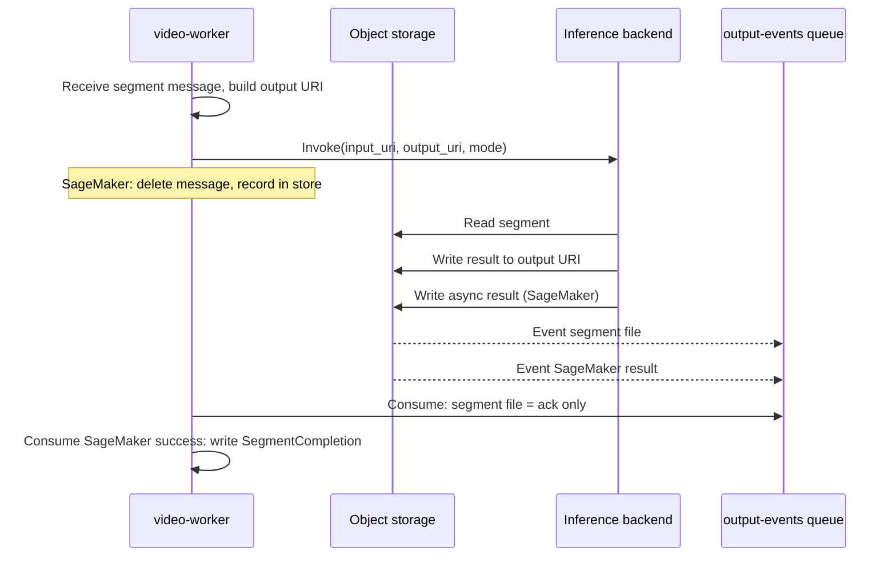

# Inference backend

Inference is **backend-switchable**: the video-worker invokes one of several backends per segment. This keeps the pipeline generic; the actual GPU/compute can be a managed service or your own HTTP server.

## Backends

| Backend | Description |
|--------|-------------|
| **stub** | Download segment, stub processing, upload result. Used for tests and local runs without GPU. |
| **Managed GPU endpoint** | e.g. SageMaker: async invoke with input/output URIs; worker deletes the segment message immediately and records the invocation in a store. Segment completion is written only when the SageMaker async result S3 object appears; the **output-events queue** receives that event and the worker writes **SegmentCompletion**. |
| **HTTP** | POST to a URL you provide (e.g. your own inference server). Request/response or fire-and-forget depending on implementation. |

No cloud-specific details here; "SageMaker" is one option. Configuration (endpoint name, URL, region) is provided by your infra (e.g. Terraform outputs or env).

## Segment flow

1. Video-worker receives a segment message (from the video-worker queue).
2. Builds canonical **output URI** for the segment (defined in shared-types).
3. Invokes the backend (stub / managed endpoint / HTTP) with input and output URIs (and mode).
4. **Stub/HTTP:** Worker writes **SegmentCompletion** and deletes the message.
5. **SageMaker:** Worker calls **InvokeEndpointAsync**, records the invocation (output_location → job/segment) in a store, and **deletes the segment message immediately**. No polling. When SageMaker writes the async result to S3, an event feeds the **output-events queue**; the video-worker consumes it and only then writes **SegmentCompletion** and triggers reassembly. Segment file events on the same queue are acknowledged only (no SegmentCompletion).

## Concurrency and backpressure

The **video-worker** limits in-flight SageMaker invocations to **INFERENCE_MAX_IN_FLIGHT** using an in-process **semaphore** shared between the inference loop and the output-events loop:

- **Inference loop:** acquires the semaphore before each `InvokeEndpointAsync` (blocks when at capacity), releases on invoke failure.
- **Output-events loop:** releases the semaphore when a SageMaker success or failure result is processed (one slot freed per completion).

This ensures the worker never sends more concurrent requests than the endpoint can handle.

- **SageMaker**: Infra sets **INFERENCE_MAX_IN_FLIGHT** from the endpoint **instance count** (`sagemaker_instance_count`). The SageMaker async endpoint is configured with **max_concurrent_invocations_per_instance = 1** (Terraform `async_inference_config.client_config`) so each instance pulls one request at a time from the internal queue; with two instances you get two parallel inferences. To scale, increase `sagemaker_instance_count` in Terraform; the video-worker and endpoint config stay aligned.
- **HTTP**: **INFERENCE_MAX_IN_FLIGHT** can be set via env (1–20); default is 5. No semaphore is used (stub/HTTP process one message at a time in the loop).

## Package

The **stereo-inference** package provides the inference container (e.g. iw3/nunif for 2D→stereo). It is built and deployed separately (e.g. via CodeBuild and SageMaker, or run as your own HTTP service). Storage and metrics are adapter-based so the same image can target AWS or GCP.
