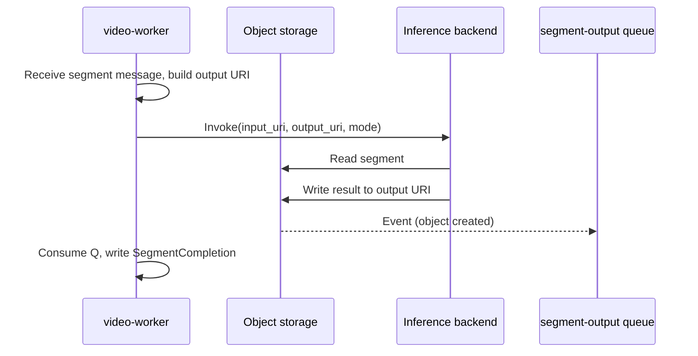

# Inference backend

Inference is **backend-switchable**: the video-worker invokes one of several backends per segment. This keeps the pipeline generic; the actual GPU/compute can be a managed service or your own HTTP server.

## Backends

| Backend | Description |
|--------|-------------|
| **stub** | Download segment, stub processing, upload result. Used for tests and local runs without GPU. |
| **Managed GPU endpoint** | e.g. SageMaker: async invoke with input/output URIs; worker polls for completion. Segment completion is event-driven when the endpoint writes the output (segment-output queue). |
| **HTTP** | POST to a URL you provide (e.g. your own inference server). Request/response or fire-and-forget depending on implementation. |

No cloud-specific details here; "SageMaker" is one option. Configuration (endpoint name, URL, region) is provided by your infra (e.g. Terraform outputs or env).

## Segment flow

1. Video-worker receives a segment message (from the video-worker queue).
2. Builds canonical **output URI** for the segment (defined in shared-types).
3. Invokes the backend (stub / managed endpoint / HTTP) with input and output URIs (and mode).
4. Backend reads segment from storage, runs inference, writes result to output URI.
5. When the output object is written, an event feeds the **segment-output queue**; the video-worker writes a **SegmentCompletion** record. Completion is thus **event-driven** from storage, not by polling.

## Package

The **stereo-inference** package provides the inference container (e.g. iw3/nunif for 2D→stereo). It is built and deployed separately (e.g. via CodeBuild and SageMaker, or run as your own HTTP service). Storage and metrics are adapter-based so the same image can target AWS or GCP.
