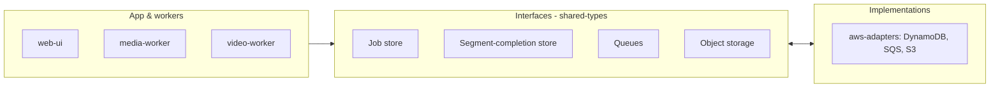

# Architecture overview

StereoSpot is designed for **high-throughput, cost-optimized video processing** using a **job–worker** pattern. It uses **cloud-agnostic abstractions** so the pipeline logic is independent of the cloud provider; implementations (e.g. AWS) live in adapter packages.

## Nx monorepo structure

All packages live under **`packages/`**. The **root project** `stereo-spot` provides **`install-deps`**: a single editable install of all Python monorepo packages. Lint, test, smoke-test, serve, and gather targets depend on it.

| Package | Role (short) |
|--------|---------------|
| **web-ui** | FastAPI UI, dashboard, jobs, upload, playback |
| **media-worker** | Chunking + reassembly (ffmpeg, queues) |
| **video-worker** | Segment processing, inference, reassembly trigger |
| **stereo-inference** | Inference container (iw3/nunif), SageMaker/HTTP |
| **shared-types** | Pydantic models, cloud-agnostic interfaces |
| **adapters** | Platform facade: selects aws-adapters or gcp-adapters by `PLATFORM` env |
| **aws-adapters** | DynamoDB, SQS, S3 implementations (used when `PLATFORM=aws`) |
| **aws-infra** | Terraform: ECS, S3, SQS, DynamoDB, SageMaker, ALB |
| **aws-infra-setup** | Terraform state bucket, lock table |

See [Packages](/docs/packages/overview) for purpose, main targets, env vars, and dependencies per package.

To add another cloud later, add separate packages (e.g. `google-infra-setup`, `google-infra`) and adapters (Firestore, Pub/Sub, GCS) behind the same interfaces.

## Portability and cloud abstractions

Pipeline logic uses **shared-types** and thin interfaces for:

- **Job store** — get/put/update job
- **Segment-completion store** — put completion, query by job ordered by segment_index
- **Queues** — send/receive messages
- **Object storage** — presign upload/download, upload/download
- **Operator links (optional)** — job logs URL, cost dashboard URL (e.g. web-ui “Open logs”, “Cost” nav link)

**AWS** implementations live in **aws-adapters**. The **adapters** package is the single composition root: it reads **`PLATFORM`** (default `aws`) and exposes `*_from_env()` factories that delegate to aws-adapters or, when added, gcp-adapters. Apps and workers import from **adapters** and stay cloud-agnostic. See [Platform adapter facade](/docs/architecture/platform-adapters). Terraform remains per-cloud; application and worker code stay the same.
