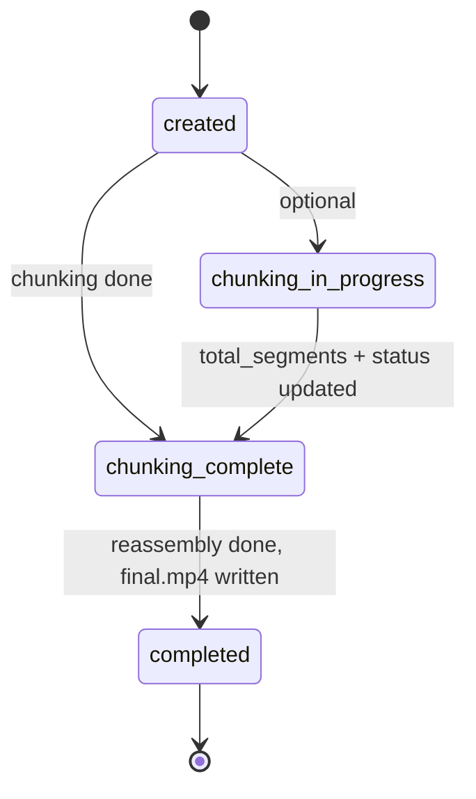

# Pipeline concepts

End-to-end flow: **upload → chunking → segment processing (inference) → segment completion → reassembly trigger → reassembly → final output**. Storage and queues are described in abstract terms (job store, queues, object storage) so the flow applies to any cloud.

## High-level flow

1. **Upload** — User gets a presigned URL and uploads the source file. An event (e.g. object-created) notifies the **chunking queue**.
2. **Chunking** — A worker consumes the chunking message, splits the source with ffmpeg into segments, and uploads segment files to object storage. Segment keys follow a **canonical format** (defined in shared-types). When done, the worker updates the job: **total_segments** and **status = chunking_complete** in a single atomic update.
3. **Segment processing** — Object-created events for segment files feed a **video-worker queue**. Workers invoke the **inference backend** (stub, managed GPU endpoint, or HTTP) per segment. Inference reads the segment and writes the result to the output bucket.
4. **Segment completion** — When the inference side writes a segment output, an event feeds a **segment-output queue**. A worker writes a **SegmentCompletion** record to the segment-completion store (one record per segment, ordered by segment_index).
5. **Reassembly trigger** — After each SegmentCompletion put, the video-worker runs **trigger-on-write**: if the job has **status = chunking_complete** and **count(SegmentCompletions) == total_segments**, it conditionally creates a reassembly lock and sends **job_id** to the **reassembly queue**.
6. **Reassembly** — A worker consumes the reassembly queue, builds the concat list from the segment-completion store (no object list), runs ffmpeg concat, uploads **final.mp4**, and updates the job to **status = completed**.

## Job status lifecycle

- **created** — Set when the job is created (e.g. by web-ui).
- **chunking_in_progress** — Set when chunking starts (optional; helps recovery tools find stuck jobs).
- **chunking_complete** — Set in one atomic update when chunking finishes (**total_segments** and **status**).
- **completed** — Set by the reassembly worker after writing the final file.

Only the job store is authoritative for status.

## Segment key convention

Segment object keys follow **one** format so chunking and segment-processing workers stay in sync. The **parser lives only in shared-types**; both media-worker (when building keys) and video-worker (when parsing events) use it. Example pattern:

`segments/{job_id}/{segment_index:05d}_{total_segments:05d}_{mode}.mp4`

Zero-padding keeps lexicographic order and avoids ambiguity.

## Idempotency

- Chunking and segment processing use **deterministic keys**; retries overwrite the same objects.
- Reassembly trigger uses a **conditional create** on a lock table so at most one reassembly message per job is sent.
- Reassembly worker uses a **conditional update** on the lock so only one worker runs reassembly per job.

## Job removal

Users can remove a job from the dashboard (completed or failed only). Removal is **soft delete** plus **asynchronous cleanup**:

1. **Soft delete** — The web-ui sets the job **status = deleted** and sends a message containing **job_id** to the **deletion queue**. The job disappears from list views immediately (list_completed and list_in_progress do not include deleted).
2. **Deletion queue** — A dedicated SQS queue consumed by the **media-worker**. No S3 events; only the web-ui sends to this queue.
3. **Deletion loop** — The media-worker runs a third loop (with chunking and reassembly) that processes deletion messages: deletes objects in the input bucket (`input/{job_id}/source.mp4`, `segments/{job_id}/*`), in the output bucket (`jobs/{job_id}/*`), deletes SegmentCompletions and ReassemblyTriggered records for the job. The job record remains with **status = deleted** (no hard delete of the job row).
4. **Restriction** — Remove is allowed only when the job is **completed** or **failed** to avoid races with in-flight chunking or inference. Direct links to a deleted job return 404.

Cleanup (S3 and DynamoDB) is asynchronous; the user sees "Job removed. Cleanup in progress." after redirect. Failed deletion messages go to the deletion DLQ like other queues.
