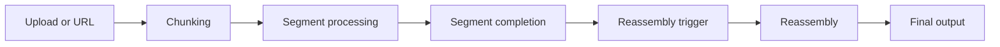
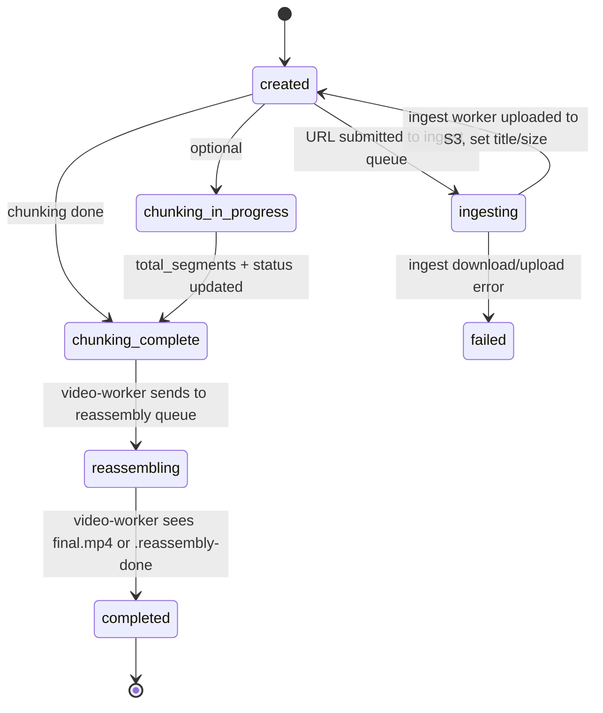

# Pipeline concepts

End-to-end flow: **upload or URL ingest → chunking → segment processing (inference) → segment completion → reassembly trigger → reassembly → final output**. Storage and queues are described in abstract terms (job store, queues, object storage) so the flow applies to any cloud.

## High-level flow

1. **Upload** — On the dashboard the user clicks **Create job** (with output format) and is redirected to the job page. There they can either **upload a file** (presigned PUT to the input key) or **paste a video URL** (e.g. YouTube); choosing one hides the other. If they paste a URL and click **Fetch from URL**, the web-ui sends an **ingest message** (job_id, source_url, source_type) to the **ingest queue** and sets the job to **ingesting**. The media-worker **ingest loop** consumes it: downloads the video (e.g. with yt-dlp), uploads it to `input/\{job_id\}/source.mp4`, sets job **title**, **uploaded_at**, and **source_file_size_bytes** (so ETA and conversion stats stay consistent with the upload path), then sets status back to **created**. The S3 object-created event notifies the chunking queue and the rest of the pipeline is the same.
2. **Chunking** — A worker consumes the chunking message, splits the source with ffmpeg into segments, and uploads segment files to object storage. Segment keys follow a **canonical format** (defined in shared-types). When done, the worker updates the job: **total_segments** and **status = chunking_complete** in a single atomic update.
3. **Segment processing** — Object-created events for segment files feed a **video-worker queue**. Workers invoke the **inference backend** (stub, managed GPU endpoint, or HTTP) per segment. Inference reads the segment and writes the result to the output bucket.
4. **Segment completion** — When the inference backend writes a segment (and, for SageMaker, the async result), S3 sends events to the **output-events queue**. The video-worker consumes them: **segment file** events are acknowledged only; **SageMaker result** events trigger a **SegmentCompletion** write. So completion is recorded only when the worker processes a SageMaker success event (single source of truth).
5. **Reassembly trigger** — After each SegmentCompletion put, the video-worker runs **trigger-on-write**: if the job has **status = chunking_complete** and **count(SegmentCompletions) == total_segments**, it conditionally creates a reassembly lock and sends **job_id** to the **reassembly queue**.
6. **Reassembly** — The **video-worker** sets job **status = reassembling** when it sends the job to the reassembly queue. A **media-worker** consumes the reassembly queue: downloads each segment via streaming, builds the concat list from the segment-completion store, runs ffmpeg concat, and uploads **final.mp4** (it does not update job status). If **final.mp4** already exists (idempotent), the media-worker writes a **.reassembly-done** sentinel object so an S3 event is emitted. The **video-worker** consumes output-events; when it sees an S3 event for **jobs/\{job_id\}/final.mp4** or **jobs/\{job_id\}/.reassembly-done**, it sets the job to **status = completed** and **completed_at**. So only the video-worker sets **reassembling** and **completed** for this phase.

## Job status lifecycle

- **created** — Set when the job is created (e.g. by web-ui). Waiting for source: either user upload or ingest worker will place the file.
- **ingesting** — Set when the media-worker ingest loop starts fetching from the source URL. When the worker finishes, it uploads to S3 and updates the job to **created** (with title, uploaded_at, source_file_size_bytes); the S3 event then drives chunking. On failure, the job is set to **failed**.
- **chunking_in_progress** — Set when chunking starts (optional; helps recovery tools find stuck jobs).
- **chunking_complete** — Set in one atomic update when chunking finishes (**total_segments** and **status**).
- **reassembling** — Set by the video-worker when it sends the job to the reassembly queue (after all segment completions are in).
- **completed** — Set by the video-worker when it sees an output-events S3 notification for **final.mp4** or **.reassembly-done** (media-worker only writes those objects; it does not update job status).

Only the job store is authoritative for status.

## Job events and real-time updates

Job status changes (and segment completions) are pushed to the web-ui for **live progress** (SSE) and **desktop notifications** (Web Push) without polling the job store.

1. **DynamoDB streams** — The **jobs** table and **segment_completions** table have streams enabled. Any insert or update produces a stream record.
2. **EventBridge Pipes** — Two Pipes (jobs stream and segment_completions stream) send raw DynamoDB stream events to the **job-events SQS queue** (pass-through, no enrichment). Message bodies are the stream event (single record or `Records` array).
3. **Job-events queue** — One SQS queue. The web-ui long-polls it in a background task.
4. **Web-ui** — The consumer receives each message, **normalizes** each stream record (aws-adapters, using stream ARNs to distinguish tables), **computes progress in-process** (same logic as the job detail page), and pushes to registered SSE connections and Web Push via an **in-process sink**. On **SSE** connect (`GET /jobs/\{job_id\}/events`), the server sends **initial state** (one read from the job store and segment store), then registers the connection. No polling of DynamoDB for progress when the queue is configured. When the job-events queue is not configured (e.g. local dev), the SSE endpoint falls back to polling the store.
5. **Web Push** — When the consumer sees a **completed** or **failed** event (from the in-process sink), it loads push subscriptions from the **push_subscriptions** DynamoDB table and sends a desktop notification (via pywebpush and VAPID). Users can subscribe on first visit (prompt in the web UI); the service worker shows the notification and opens the job page on click.

So the **single source of truth** remains DynamoDB; the **single event path** is streams → Pipes → job-events queue → web-ui (normalize + handle + SSE + Web Push).

## Segment key convention

Segment object keys follow **one** format so chunking and segment-processing workers stay in sync. The **parser lives only in shared-types**; both media-worker (when building keys) and video-worker (when parsing events) use it. Example pattern:

`segments/\{job_id\}/\{segment_index:05d\}_\{total_segments:05d\}_\{mode\}.mp4`

Zero-padding keeps lexicographic order and avoids ambiguity.

## Idempotency

- Chunking and segment processing use **deterministic keys**; retries overwrite the same objects.
- Reassembly trigger uses a **conditional create** on a lock table so at most one reassembly message per job is sent.
- Reassembly worker uses a **conditional update** on the lock so only one worker runs reassembly per job.

## Job removal

Users can remove a job from the dashboard (completed or failed only). Removal is **soft delete** plus **asynchronous cleanup**:

1. **Soft delete** — The web-ui sets the job **status = deleted** and sends a message containing **job_id** to the **deletion queue**. The job disappears from list views immediately (list_completed and list_in_progress do not include deleted).
2. **Deletion queue** — A dedicated SQS queue consumed by the **media-worker**. No S3 events; only the web-ui sends to this queue.
3. **Deletion loop** — The media-worker runs a third loop (with chunking and reassembly) that processes deletion messages: deletes objects in the input bucket (`input/\{job_id\}/source.mp4`, `segments/\{job_id\}/*`), in the output bucket (`jobs/\{job_id\}/*`), deletes SegmentCompletions and ReassemblyTriggered records for the job. The job record remains with **status = deleted** (no hard delete of the job row).
4. **Restriction** — Remove is allowed only when the job is **completed** or **failed** to avoid races with in-flight chunking or inference. Direct links to a deleted job return 404.

Cleanup (S3 and DynamoDB) is asynchronous; the user sees "Job removed. Cleanup in progress." after redirect. Failed deletion messages go to the deletion DLQ like other queues.

## Create job from URL

On AWS, **YouTube URL ingest** is optional and controlled by the Terraform variable **`enable_youtube_ingest`**. When it is disabled, the ingest queue and related resources are not created; the web UI shows only the upload option and the media-worker does not run the ingest loop. The following describes behavior when URL ingest is enabled.

Users can provide source video via **paste a video URL** (e.g. YouTube) instead of uploading a file:

1. On the dashboard the user clicks **Create job** (with output format) and is redirected to the job page.
2. On the job page, two options are shown side-by-side: **Upload your video** (file input) and **Or paste a video URL**. Choosing one (e.g. selecting a file or clicking Fetch from URL) hides the other.
3. If the user enters a YouTube URL and clicks **Fetch from URL**, the web-ui calls **POST /jobs/\{job_id\}/ingest-from-url**, which sets the job to **ingesting** and sends an **IngestPayload** (job_id, source_url, source_type) to the **ingest queue**.
4. Media-worker **ingest loop** polls the queue; when it picks up the message it downloads the video (e.g. with yt-dlp in best MP4 quality, **capped at 1080p** by default to limit size). It uploads to `input/\{job_id\}/source.mp4`, then updates the job with **title** (from video metadata), **uploaded_at**, **source_file_size_bytes**, and **status = created**. To change the resolution cap, set **MAX_VIDEO_HEIGHT** (env, default 1080).
5. The S3 object-created event triggers the chunking queue; from there the pipeline is identical to the upload path.

**ETA and conversion stats:** For URL jobs, the ingest worker sets `uploaded_at`, `source_file_size_bytes`, and `title` when it finishes uploading. The web-ui uses the same fields for the per-job ETA countdown and for "Conversion: X min (Y sec/MB)" on completed jobs, so URL and upload jobs are treated consistently.
