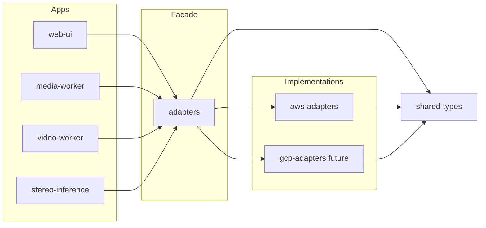

# Platform adapter facade

The **`adapters`** package (stereo-spot-adapters) is the **single composition root** for cloud implementations. It reads the **`PLATFORM`** environment variable and delegates to the corresponding adapter package (e.g. aws-adapters, or gcp-adapters when added).

## PLATFORM env

| Variable | Values | Default | Purpose |
|----------|--------|---------|---------|
| **PLATFORM** | `aws`, `gcp` | `aws` | Which cloud adapter to use for job store, queues, object storage, operator links, etc. |

- **`aws`** — Use **aws-adapters** (DynamoDB, SQS, S3, CloudWatch). All current deployments use this.
- **`gcp`** — Reserved for a future **gcp-adapters** package (Firestore, Pub/Sub, GCS). Not yet implemented; setting `PLATFORM=gcp` will raise a clear error.

Apps and workers do **not** read `PLATFORM` themselves. They call `*_from_env()` (e.g. `object_storage_from_env()`, `job_store_from_env()`) from the **adapters** package; the facade selects the implementation inside those functions.

## Architecture

- **shared-types** — Defines protocols (JobStore, ObjectStorage, QueueSender, etc.). No cloud-specific code.
- **adapters** — Exposes `object_storage_from_env()`, `job_store_from_env()`, and all other `*_from_env()` factories. Reads `PLATFORM` and calls the right cloud package.
- **aws-adapters** / **gcp-adapters** — Concrete implementations. Apps depend on **adapters**, not directly on aws-adapters or gcp-adapters, for wiring.

## Adding GCP

1. Add a **gcp-adapters** package that implements the same interfaces (e.g. ObjectStorage with GCS, JobStore with Firestore).
2. Add it as a dependency of **adapters** and implement the `"gcp"` branch in `stereo_spot_adapters.env_config` (each `*_from_env()` delegates to gcp-adapters when `PLATFORM=gcp`).
3. No changes required in web-ui, media-worker, video-worker, or stereo-inference; they already use the facade.
