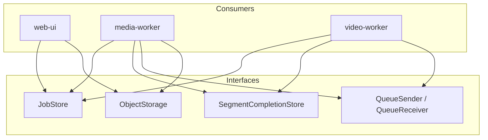

# Shared types and interfaces

The **`shared-types`** library defines Pydantic models and **cloud-agnostic interfaces** for the pipeline. Application and worker code depend on these interfaces; concrete implementations (e.g. AWS) are provided by adapter packages and wired via configuration (e.g. `STORAGE_ADAPTER=aws`).

## Interfaces

### JobStore

**Methods:** `get(job_id)`, `put(job)`, `update(job_id, status=..., total_segments=..., completed_at=..., title=..., uploaded_at=..., source_file_size_bytes=...)`, `list_completed(limit, exclusive_start_key=None)`, `list_in_progress(limit=20)`.

**Purpose:** Single source of truth for job metadata (mode, status, total_segments, timestamps, optional title, optional timing). Used for create job, update status after chunking/reassembly, and list completed jobs for the UI. **Job** and **JobListItem** have an optional `title` (display name, e.g. from the upload filename); the web-ui sets it via PATCH after upload and uses it in the dashboard/detail and as the suggested download filename (e.g. `attack-on-titan3d.mp4`). Optional `uploaded_at` (Unix timestamp when upload finished) and `source_file_size_bytes` (size of uploaded file) are set by the web-ui on PATCH after upload; they are used for a data-driven ETA (lazy TTL-cached average sec/MB from recent completed jobs) and for showing conversion time and sec/MB on completed jobs.

**Consumers:** web-ui (create, get, list), media-worker chunking (get mode, update chunking_complete), media-worker reassembly (get, update completed), video-worker reassembly trigger (get total_segments, status).

---

### SegmentCompletionStore

**Methods:** `put(completion)`, `query_by_job(job_id)`.

**Purpose:** Records each segment completion (output_uri, completed_at). Query by job returns completions ordered by segment_index for reassembly.

**Consumers:** video-worker (put after each segment); video-worker trigger (query + count vs total_segments); media-worker reassembly (query to build concat list).

---

### QueueSender / QueueReceiver

**QueueSender:** `send(body)` — send one message (body as str or bytes).

**QueueReceiver:** `receive(max_messages=1)` → list of messages (receipt_handle, body); `delete(receipt_handle)` — delete after successful processing.

**Purpose:** Decouple producers and consumers (chunking queue, video-worker queue, reassembly queue). Same interface for SQS, Pub/Sub, etc.

**Consumers:** media-worker (chunking and reassembly queues); video-worker (video-worker queue, segment-output queue; sends to reassembly queue).

---

### ObjectStorage

**Methods:** `presign_upload(bucket, key, expires_in=3600)`, `presign_download(bucket, key, expires_in=3600, response_content_disposition=None)`, `upload(bucket, key, body)`, `download(bucket, key)`.

**Purpose:** Upload/download bytes and generate presigned URLs for direct browser/client access (upload source file, playback final file).

**Consumers:** web-ui (presign upload/download); media-worker (download source, upload segments and final); video-worker (segment in/out via inference).

---

### OperatorLinksProvider

**Methods:** `get_job_logs_url(job_id) → str | None`, `get_cost_dashboard_url() → str | None`.

**Purpose:** Optional provider for operator-facing console links: a deep link to view logs for a job, and a link to the cost/billing dashboard (e.g. filtered by app). When not set (e.g. not deployed on a supported cloud), the web-ui hides these links. Keeps the web-ui cloud-agnostic; implementations are cloud-specific (e.g. AWS: CloudWatch Logs Insights, Cost Explorer).

**Consumers:** web-ui (job detail “Open logs”, top nav “Cost” link). Injected via `get_operator_links_provider(request)`; when `NAME_PREFIX` is set (e.g. ECS), aws-adapters returns an implementation.

## Implementation

- **AWS:** Implementations in **aws-adapters** (DynamoDB, SQS, S3). Used when `STORAGE_ADAPTER=aws` (or equivalent).
- **GCP (future):** Same interfaces with Firestore, Pub/Sub, GCS in a separate package; pipeline code unchanged.
