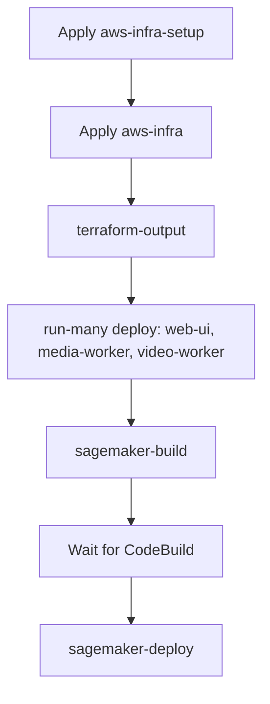

# Bringing the solution up (AWS)

One-time sequence to get StereoSpot running on AWS: provision infra, generate the env file, deploy app images, then build and deploy the inference endpoint.

## Prerequisites

- **AWS credentials** configured (e.g. `AWS_PROFILE` or default credentials).
- **Node and npm** at the workspace root; run `npm ci` if you have not already.
- **Docker** for building and pushing app images (web-ui, media-worker, video-worker).

## The aws-infra .env file (generated)

The **`packages/aws-infra/.env`** file holds Terraform outputs (bucket names, queue URLs, ECR URLs, table names, etc.) for deploy targets, smoke tests, and runbook commands. For the **root** `.env` (Terraform variables and AWS credentials when running Terraform or AWS CLI locally), see [Environment files](/docs/intro#environment-files) in the intro.

- **Where it lives:** `packages/aws-infra/.env`
- **How you get it:** Run **`nx run aws-infra:terraform-output`** after Terraform has been applied. This target reads the current Terraform state and writes variable assignments to that file.
- **When to use it:** Deploy targets and scripts load it automatically; you do not need to source it in your shell.
- **Optional (SageMaker):** You may add **`HF_TOKEN`** (your [Hugging Face token](https://huggingface.co/settings/tokens)) to this file so the inference container can download the model. Use the **`update-hf-token`** target to write it to AWS Secrets Manager (see step 4 below).

If you change infra (e.g. run `terraform-apply` again), re-run `nx run aws-infra:terraform-output` to refresh it.

## Bring-up sequence



Do these steps in order from the **workspace root**.

### 1. Apply infrastructure

Create the Terraform backend first (state bucket and lock table), then the main infra:

```bash
nx run aws-infra-setup:terraform-init
nx run aws-infra-setup:terraform-apply

nx run aws-infra:terraform-init
nx run aws-infra:terraform-plan    # optional: review
nx run aws-infra:terraform-apply
```

### 2. Generate the aws-infra .env file

Write Terraform outputs to `packages/aws-infra/.env` so deploy and runbooks can use them:

```bash
nx run aws-infra:terraform-output
```

### 3. Deploy app images (web-ui, media-worker, video-worker)

Build Docker images, push to ECR, and trigger ECS to pull the new images:

```bash
nx run-many -t deploy --projects=web-ui,media-worker,video-worker
```

Each project’s `deploy` target depends on `aws-infra:terraform-output` and uses the ECR URLs and cluster name from `.env`.

### 4. Build and deploy the inference endpoint (SageMaker)

If you use SageMaker for inference (default), build the inference image in CodeBuild, then update the endpoint **after** the image has been published.

**Set the Hugging Face token** (required for the inference container to download the model): add `HF_TOKEN=your_token` to `packages/aws-infra/.env`, then run:

```bash
nx run aws-infra:update-hf-token
```

This writes the token to the secret at `HF_TOKEN_SECRET_ARN` (from the same `.env`). Requires **jq** on your PATH.

Then:

1. **Trigger the build** (CodeBuild builds and pushes the image to ECR):

   ```bash
   nx run stereo-inference:sagemaker-build
   ```

2. **Wait** for the CodeBuild job to finish (check the AWS CodeBuild console or pipeline).

3. **Update the SageMaker endpoint** to use the new image:

   ```bash
   nx run stereo-inference:sagemaker-deploy
   ```

If you use **HTTP inference** instead of SageMaker, skip this step and run your own inference server; point the video-worker at it via `INFERENCE_HTTP_URL` (set in Terraform / `.env`).

## Verify

- Open the web UI (ALB URL from Terraform or `.env`).
- Create a job, upload a video, and confirm the pipeline runs (chunking → segment processing → reassembly).
- Optionally run the data-plane smoke test: `nx run aws-adapters:smoke-test` (with `.env` loaded).

## See also

- [AWS build and deploy](/docs/aws/build-and-deploy) — Deploy order and manual steps for updates.
- [AWS runbooks](/docs/aws/runbooks) — Recovery and operations (DLQ, scaling, SageMaker update).
- [AWS infrastructure](/docs/aws/infrastructure) — Terraform layout and Nx targets.
