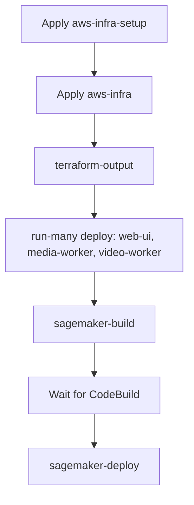

# Bringing the solution up (AWS)

One-time sequence to get StereoSpot running on AWS: provision infra, generate the env file, deploy app images, then build and deploy the inference endpoint.

## Prerequisites

- **AWS credentials** configured (e.g. `AWS_PROFILE` or default credentials).
- **Node and npm** at the workspace root; run `npm ci` if you have not already.
- **Docker** for building and pushing app images (web-ui, media-worker, video-worker). When using SageMaker, the first `terraform-apply` builds and pushes a minimal stub image (GET /ping, POST /invocations) so the endpoint reaches InService; you replace it with the real image in step 4.

## The aws-infra .env file (generated)

The **`packages/aws-infra/.env`** file holds Terraform outputs (bucket names, queue URLs, ECR URLs, table names, etc.) for deploy targets, smoke tests, and runbook commands. For the **root** `.env` (Terraform variables and AWS credentials when running Terraform or AWS CLI locally), see [Environment files](/docs/intro#environment-files) in the intro.

- **Where it lives:** `packages/aws-infra/.env`
- **How you get it:** Run **`nx run aws-infra:terraform-output`** after Terraform has been applied. This target reads the current Terraform state and writes variable assignments to that file.
- **When to use it:** Deploy targets and scripts load it automatically; you do not need to source it in your shell.
- **Optional (SageMaker):** You may add **`HF_TOKEN`** (your [Hugging Face token](https://huggingface.co/settings/tokens)) to this file so the inference container can download the model. Use the **`update-hf-token`** target to write it to AWS Secrets Manager (see step 4 below).
- **Optional (when YouTube URL ingest is enabled):** To avoid "Sign in to confirm you're not a bot" when fetching YouTube URLs, add **`YTDLP_COOKIES_FILE`** (path to a Netscape-format cookies file, e.g. `ytdlp_cookies.txt` at workspace root) and run **`update-ytdlp-cookies`** to push it to Secrets Manager. See [Optional: YouTube URL ingest](#optional-youtube-url-ingest) and [Optional: yt-dlp cookies](#optional-yt-dlp-cookies) below.

If you change infra (e.g. run `terraform-apply` again), re-run `nx run aws-infra:terraform-output` to refresh it.

## Bring-up sequence



Do these steps in order from the **workspace root**.

### 1. Apply infrastructure

Create the Terraform backend first (state bucket and lock table), then the main infra:

```bash
nx run aws-infra-setup:terraform-init
nx run aws-infra-setup:terraform-apply

nx run aws-infra:terraform-init
nx run aws-infra:terraform-plan    # optional: review
nx run aws-infra:terraform-apply
```

### 2. Generate the aws-infra .env file

Write Terraform outputs to `packages/aws-infra/.env` so deploy and runbooks can use them:

```bash
nx run aws-infra:terraform-output
```

### 3. Deploy app images (web-ui, media-worker, video-worker)

Build Docker images, push to ECR, and trigger ECS to pull the new images:

```bash
nx run-many -t deploy --projects=web-ui,media-worker,video-worker
```

Each project’s `deploy` target depends on `aws-infra:terraform-output` and uses the ECR URLs and cluster name from `.env`.

### 4. Build and deploy the inference endpoint (SageMaker)

If you use SageMaker for inference (default), the first apply pushed a minimal stub image so the endpoint could reach InService. Build the real inference image in CodeBuild, then update the endpoint so it serves the real image.

**Set the Hugging Face token** (required for the inference container to download the model): add `HF_TOKEN=your_token` to `packages/aws-infra/.env`, then run:

```bash
nx run aws-infra:update-hf-token
```

This writes the token to the secret at `HF_TOKEN_SECRET_ARN` (from the same `.env`). Requires **jq** on your PATH.

Then:

1. **Trigger the build** (CodeBuild builds and pushes the image to ECR):

   ```bash
   nx run stereo-inference:sagemaker-build
   ```

2. **Wait** for the CodeBuild job to finish (check the AWS CodeBuild console or pipeline).

3. **Update the SageMaker endpoint** to use the new image:

   ```bash
   nx run stereo-inference:sagemaker-deploy
   ```

If you use **HTTP inference** instead of SageMaker, skip this step and run your own inference server; point the video-worker at it via `INFERENCE_HTTP_URL` (set in Terraform / `.env`).

### Optional: YouTube URL ingest

**YouTube URL ingest** (paste a video URL on the job page instead of uploading a file) is **optional** and controlled by the Terraform variable **`enable_youtube_ingest`** (default: `true`).

- **When `enable_youtube_ingest = true`** (default): Terraform creates the ingest SQS queue, the yt-dlp cookies secret (placeholder), and passes `INGEST_QUEUE_URL` to web-ui and media-worker. The web UI shows "Or paste a video URL"; the media-worker runs the ingest loop. Prerequisites for a good experience: see [Optional: yt-dlp cookies](#optional-yt-dlp-cookies) below (cookies reduce "Sign in to confirm you're not a bot" from YouTube).
- **When `enable_youtube_ingest = false`**: No ingest queue or cookies secret is created; `INGEST_QUEUE_URL` is not set. The web UI shows only the upload option; the media-worker skips the ingest loop. Use this if you only want file-upload jobs (e.g. to avoid YouTube rate limits or to simplify operations).

To disable the feature, set in `packages/aws-infra/.env` or Terraform variables (e.g. `tfvars`):

```bash
enable_youtube_ingest=false
```

Then run `terraform-apply` and `terraform-output`; re-deploy web-ui and media-worker so they pick up the new env (no `INGEST_QUEUE_URL`).

### Optional: yt-dlp cookies

When YouTube URL ingest is enabled and users paste a YouTube URL, the media-worker downloads the video with yt-dlp. Some videos trigger YouTube’s "Sign in to confirm you're not a bot" when no cookies are sent. To fix that, use a **dedicated** Google/YouTube account (not your personal one), export its cookies, and store them in Secrets Manager.

1. **Export cookies (Netscape format)**  
   - In Chrome: install [Get cookies.txt LOCALLY](https://chromewebstore.google.com/detail/get-cookiestxt-locally/cclelndahbckbenkjhflpdbgdldlbecc). Log in to YouTube with the dedicated account, open the extension, export cookies for the current site in Netscape / cookies.txt format.  
   - Save the file (e.g. as `ytdlp_cookies.txt` at the workspace root). Do **not** commit it (`ytdlp_cookies.txt` is in `.gitignore`).

2. **Add to `packages/aws-infra/.env`**  
   - Set `YTDLP_COOKIES_FILE` to the path to that file (e.g. `ytdlp_cookies.txt` if at workspace root; the target runs with `cwd` at workspace root).  
   - After `terraform-output`, the same `.env` will contain `YTDLP_COOKIES_SECRET_ARN`.

3. **Push to Secrets Manager**  
   - Run:  
     ```bash
     nx run aws-infra:update-ytdlp-cookies
     ```  
   - Requires **jq** on your PATH. This reads the file and stores it in the secret at `YTDLP_COOKIES_SECRET_ARN`. The media-worker fetches the secret at startup and passes the cookies to yt-dlp.

Cookies expire; re-export and run `update-ytdlp-cookies` periodically if downloads start failing again.

## Verify

- Open the web UI (ALB URL from Terraform or `.env`).
- Create a job, upload a video, and confirm the pipeline runs (chunking → segment processing → reassembly).
- Optionally run the data-plane smoke test: `nx run aws-adapters:smoke-test` (with `.env` loaded).

## See also

- [AWS build and deploy](/docs/aws/build-and-deploy) — Deploy order and manual steps for updates.
- [AWS runbooks](/docs/aws/runbooks) — Recovery and operations (DLQ, scaling, SageMaker update).
- [AWS infrastructure](/docs/aws/infrastructure) — Terraform layout and Nx targets.
