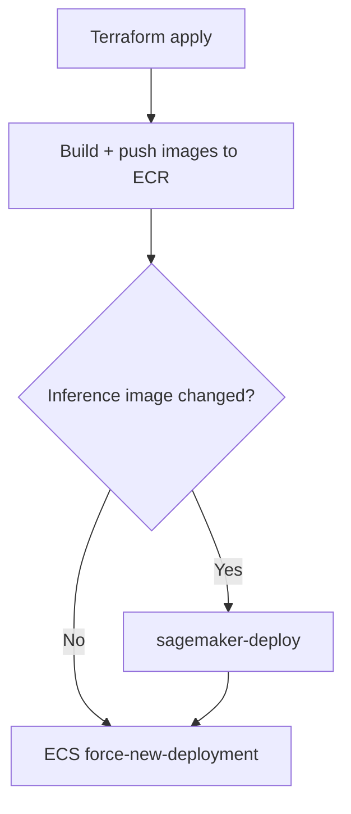

# AWS build and deploy

Build and push images, then deploy ECS (and SageMaker if used). Order of operations matters.

**First-time setup?** See [Bringing the solution up (AWS)](/docs/aws/bring-up) for the full sequence (infra, .env, deploy, SageMaker).

## Build and push

- **web-ui, media-worker, video-worker:** Docker build from workspace root, then push to ECR. Use the ECR URLs from Terraform output (e.g. `packages/aws-infra/.env`). Targets: `nx run web-ui:build`, `nx run media-worker:build`, `nx run video-worker:build`; then tag and push to the ECR URLs, or use the `deploy` target which depends on `terraform-output` and pushes.
- **stereo-inference:** Built by **AWS CodeBuild** (clone repo, docker build, push to ECR). Trigger: `nx run stereo-inference:sagemaker-build` (requires `aws-infra:terraform-output` and CodeBuild project name in env). When `inference_backend=http`, you build and run your own inference service elsewhere.

Builds can run in parallel. Use a single image tag per release (e.g. git SHA) if you want a consistent deploy.

## Deploy order

1. **Terraform apply** — Ensure infra is up (S3, SQS, DynamoDB, ECS, ECR, SageMaker, ALB).
2. **Build + push images** — All app images to ECR.
3. **Update SageMaker** (if `inference_backend=sagemaker` and the inference image changed): run `nx run stereo-inference:sagemaker-deploy` so the endpoint uses the new image.
4. **ECS force-new-deployment** — Update each ECS service so it pulls the new image. The `deploy` target on each app package loads `.env` and automates build, push, and force-new-deployment. Repeat for media-worker and video-worker.

Video-worker env (SageMaker endpoint name, region, or `INFERENCE_HTTP_URL`) is set by Terraform; no need to change it unless you switch backend or endpoint.

## Summary

**Full pipeline:** Terraform apply → build and push all images → `sagemaker-deploy` if inference image changed → force-new-deployment on ECS services (web-ui, media-worker, video-worker). See [AWS runbooks](/docs/aws/runbooks) for SageMaker update and recovery procedures.
