# AWS infrastructure

Terraform layout: **aws-infra-setup** (state bucket, DynamoDB lock) and **aws-infra** (S3, SQS, DynamoDB, ECS, ECR, CodeBuild, SageMaker/HTTP, ALB).

## High-level diagram

*High-level AWS services used by StereoSpot.*

```mermaid
architecture-beta
  service alb(logos:aws-elastic-load-balancing)[ALB]
  service ecs(logos:aws-fargate)[ECS Fargate]
  service s3(logos:aws-s3)[S3]
  service sqs(logos:aws-sqs)[SQS]
  service ddb(logos:aws-dynamodb)[DynamoDB]
  service sm(logos:aws-sagemaker)[SageMaker]
  service ecr(logos:aws-ecr)[ECR]
  alb:R --> L:ecs
  ecs:R --> L:s3
  ecs:R --> L:sqs
  ecs:R --> L:ddb
  ecs:R --> L:sm
  ecs:R --> L:ecr
```

## Terraform projects

- **aws-infra-setup:** S3 bucket for Terraform state, DynamoDB table for state locking. Run first; aws-infra uses it as backend.
- **aws-infra:** All application infra: S3 buckets (input, output), SQS queues (chunking, video-worker, output-events, reassembly) plus DLQs, DynamoDB tables (Jobs, SegmentCompletions, ReassemblyTriggered, InferenceInvocations when SageMaker), ECS cluster and services (web-ui, media-worker, video-worker), ECR repos, CodeBuild project (stereo-inference), SageMaker model/endpoint config/endpoint (or HTTP config), ALB. Uses nx-terraform with backendProject set to aws-infra-setup.

## DynamoDB

- **Jobs:** PK `job_id`. GSIs: `status-completed_at`, `status-created_at` for list completed / in-progress.
- **SegmentCompletions:** PK `job_id`, SK `segment_index`. Query by `job_id` returns segments in order for reassembly.
- **ReassemblyTriggered:** PK `job_id`. Used for video-worker trigger idempotency and media-worker reassembly lock. TTL on `ttl` attribute for expiry.
- **InferenceInvocations:** PK `output_location` (S3 URI of SageMaker async result). Used when inference_backend=sagemaker to correlate output-events (SageMaker result) to job/segment. TTL for cleanup.

## S3 and SQS

- **Input bucket:** Prefixes input/ (source uploads) and segments/ (segment files). Two S3 event notifications: input/*.mp4 to chunking queue; segments/*.mp4 to video-worker queue.
- **Output bucket:** Prefix `jobs/<job_id>/segments/` (segment outputs), `jobs/<job_id>/final.mp4` (final file). S3 event notifications to **output-events** queue: `jobs/*.mp4` (segment files) and `sagemaker-async-responses/`, `sagemaker-async-failures/` (SageMaker async results). Lifecycle: expire `jobs/*/segments/` after 1 day. CORS for playback.
- **Queues:** Chunking, video-worker, output-events, reassembly, deletion; optionally **ingest** when **`TF_VAR_enable_youtube_ingest=true`** (set in root `.env`). Each queue has a DLQ and max receive count (e.g. 3-5). Visibility timeouts set in Terraform (chunking 15 min, video-worker 40 min, reassembly 1 h, ingest 20 min when present). Web-ui sends to deletion (job removal) and, when ingest is enabled, to ingest (create job from URL); media-worker consumes chunking, reassembly, deletion, and ingest (if configured). Video-worker consumes video-worker and output-events queues.

## ECS

- **web-ui:** Behind ALB; task role for S3 and DynamoDB.
- **media-worker:** Scale on chunking + reassembly queue depth (Application Auto Scaling). Desired count 0 when idle.
- **video-worker:** Scale on video-worker queue depth. Desired count 0 when idle.

**SageMaker async endpoint** (when inference_backend=sagemaker): Endpoint config sets **max_concurrent_invocations_per_instance = 1** (`async_inference_config.client_config`) so each instance pulls one request at a time from the internal queue; with multiple instances this spreads work across them. The video-worker uses a semaphore to cap in-flight invocations to the instance count (see [Inference backend](/docs/architecture/inference#concurrency-and-backpressure)).

When **inference_backend=sagemaker**, the first apply builds and pushes a minimal SageMaker-compliant stub image (`packages/aws-infra/sagemaker-stub/`: GET /ping, POST /invocations on 8080) so the endpoint reaches InService. Replace it with the real image by running **inference-build** then **inference-redeploy** (see [Bringing the solution up](/docs/aws/bring-up)). Terraform run environment must have Docker and AWS CLI for that step.

The web-ui ALB serves HTTP by default. HTTPS (port 443) is optional: run the root target **`update-alb-certificates`** (see [Bringing the solution up](/docs/aws/bring-up)); it imports the cert into ACM and sets **`TF_VAR_load_balancer_certificate_id`** in the root `.env`, then apply again to attach the cert to the ALB (cert content is not in Terraform state). When HTTPS is enabled, the ALB redirects HTTP (port 80) to HTTPS with a 301, preserving host, path, and query. Web Push is only available over HTTPS: the web UI serves the VAPID public key only when the request is secure (direct HTTPS or `X-Forwarded-Proto: https`), so the notification prompt is not shown over HTTP. VAPID keys are generated in Terraform and stored in Secrets Manager (Python 3 with `cryptography` for the PEM-to-VAPID script). **Nx targets:** aws-infra: terraform-init, terraform-plan, terraform-apply, terraform-output (writes env file for workers and smoke-test), ecr-login (Docker login to ECR). **Root (stereo-spot):** update-hf-token, update-ytdlp-cookies, update-alb-certificates (set PLATFORM=aws; these push secrets or import certs and update root `.env` for Terraform variables). The ytdlp-cookies secret is created by default (like the HF token); push the cookie file via the root **update-ytdlp-cookies** target. YouTube URL ingest is enabled when **`TF_VAR_enable_youtube_ingest=true`** in root `.env`; Terraform then creates the ingest queue and passes **INGEST_QUEUE_URL** and **YTDLP_COOKIES_SECRET_ARN** to media-worker. See [nx-terraform](https://alexpialetski.github.io/nx-terraform/) for full reference.
