# AWS infrastructure

Terraform layout: **aws-infra-setup** (state bucket, DynamoDB lock) and **aws-infra** (S3, SQS, DynamoDB, ECS, ECR, CodeBuild, SageMaker/HTTP, ALB).

## High-level diagram

*High-level AWS services used by StereoSpot.*

```mermaid
architecture-beta
  service alb(logos:aws-elastic-load-balancing)[ALB]
  service ecs(logos:aws-fargate)[ECS Fargate]
  service s3(logos:aws-s3)[S3]
  service sqs(logos:aws-sqs)[SQS]
  service ddb(logos:aws-dynamodb)[DynamoDB]
  service sm(logos:aws-sagemaker)[SageMaker]
  service ecr(logos:aws-ecr)[ECR]
  alb:R --> L:ecs
  ecs:R --> L:s3
  ecs:R --> L:sqs
  ecs:R --> L:ddb
  ecs:R --> L:sm
  ecs:R --> L:ecr
```

## Terraform projects

- **aws-infra-setup:** S3 bucket for Terraform state, DynamoDB table for state locking. Run first; aws-infra uses it as backend.
- **aws-infra:** All application infra: S3 buckets (input, output), SQS queues (chunking, video-worker, segment-output, reassembly) plus DLQs, DynamoDB tables (Jobs, SegmentCompletions, ReassemblyTriggered), ECS cluster and services (web-ui, media-worker, video-worker), ECR repos, CodeBuild project (stereo-inference), SageMaker model/endpoint config/endpoint (or HTTP config), ALB. Uses nx-terraform with backendProject set to aws-infra-setup.

## DynamoDB

- **Jobs:** PK `job_id`. GSIs: `status-completed_at`, `status-created_at` for list completed / in-progress.
- **SegmentCompletions:** PK `job_id`, SK `segment_index`. Query by `job_id` returns segments in order for reassembly.
- **ReassemblyTriggered:** PK `job_id`. Used for video-worker trigger idempotency and media-worker reassembly lock. TTL on `ttl` attribute for expiry.

## S3 and SQS

- **Input bucket:** Prefixes input/ (source uploads) and segments/ (segment files). Two S3 event notifications: input/*.mp4 to chunking queue; segments/*.mp4 to video-worker queue.
- **Output bucket:** Prefix `jobs/<job_id>/segments/` (segment outputs), `jobs/<job_id>/final.mp4` (final file). Lifecycle: expire `jobs/*/segments/` after 1 day. CORS for playback.
- **Queues:** Chunking, video-worker, segment-output, reassembly; each with a DLQ and max receive count (e.g. 3-5). Visibility timeouts set in Terraform (chunking 15 min, video-worker 30 min, reassembly 10 min).

## ECS

- **web-ui:** Behind ALB; task role for S3 and DynamoDB.
- **media-worker:** Scale on chunking + reassembly queue depth (Application Auto Scaling). Desired count 0 when idle.
- **video-worker:** Scale on video-worker queue depth. Desired count 0 when idle.

Nx targets: terraform-init, terraform-plan, terraform-apply, terraform-output (writes env file for workers and smoke-test), ecr-login (Docker login to ECR), update-hf-token (writes HF_TOKEN from .env to Secrets Manager for SageMaker). See [nx-terraform](https://alexpialetski.github.io/nx-terraform/) for full reference.
